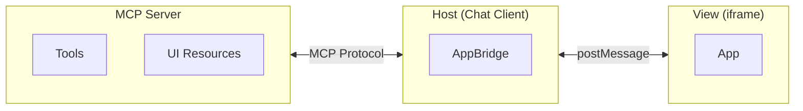
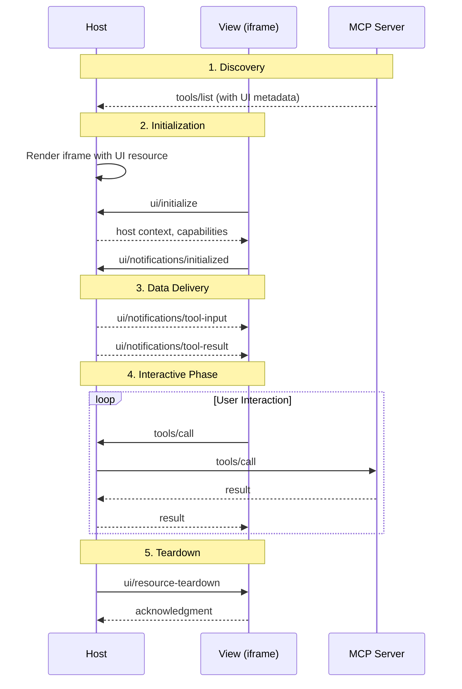

# MCP Apps Overview

MCP Apps is an extension to the Model Context Protocol that enables MCP servers to deliver interactive user interfaces to hosts. It defines how servers declare UI resources, how hosts render them securely in iframes, and how the two communicate.

## Why MCP Apps?

MCP allows servers to expose tools and resources to AI assistants, but responses are limited to text and structured data. Many use cases need more:

- **Data visualization** — Charts, graphs, and dashboards that update as data changes
- **Rich media** — Video players, audio waveforms, 3D models
- **Interactive forms** — Multi-step wizards, configuration panels, approval workflows
- **Real-time displays** — Live logs, progress indicators, streaming content

Before MCP Apps, each host implemented UI support differently. MCP-UI, OpenAI's Apps SDK, and custom implementations all solved similar problems with incompatible approaches. Server developers had to maintain separate adapters for each host, and security models varied.

MCP Apps standardizes this. Servers declare their UIs once; any compliant host can render them. Security is consistent — sandboxed iframes, auditable communication, declarative CSP. The result is write-once portability with predictable behavior.

## Progressive Enhancement

MCP Apps is designed for graceful degradation. Hosts advertise their UI support when connecting to servers; servers check these capabilities before registering UI-enabled tools. If a host doesn't support MCP Apps, tools still work — they just return text instead of UI.

This is fundamental: UI is a progressive enhancement, not a requirement. Your server works everywhere; hosts that support UI get a richer experience.

See the [Client<>Server Capability Negotiation](https://github.com/modelcontextprotocol/ext-apps/blob/main/specification/2026-01-26/apps.mdx#clientserver-capability-negotiation) section of the specification.

## Architecture

In MCP Apps, three entities work together:



- **Server** — A standard MCP server that declares tools and UI resources. The server defines what the UI looks like (HTML) and what tools it exposes.
- **Host** — The chat client (e.g., Claude Desktop) that connects to servers, embeds Views in iframes, and proxies communication between them.
- **View** — The UI running inside a sandboxed iframe. It receives tool data from the Host and can call server tools or send messages back to the chat.

The View acts as an MCP client, the Host acts as a proxy, and the Server is a standard MCP server.

## Lifecycle



1. **Discovery** — The Host learns about tools and their UI resources when connecting to the server.
2. **Initialization** — When a UI tool is called, the Host renders the iframe. The View sends `ui/initialize` and receives host context (theme, capabilities, container dimensions). This handshake ensures the View is ready before receiving data.
3. **Data delivery** — The Host sends tool arguments and, once available, tool results to the View. Results include both `content` (text for the model's context) and optionally `structuredContent` (data optimized for UI rendering). This separation lets servers provide rich data to the UI without bloating the model's context.
4. **Interactive phase** — The user interacts with the View. The View can call tools, send messages, or update context.
5. **Teardown** — Before unmounting, the Host notifies the View so it can save state or release resources.

See the [Lifecycle](https://github.com/modelcontextprotocol/ext-apps/blob/main/specification/2026-01-26/apps.mdx#lifecycle) section of the specification for the complete sequence diagrams.

## UI Resources

UI resources are HTML templates that servers declare using the `ui://` URI scheme. When a tool with UI metadata is called, the Host fetches the corresponding resource and renders it.

Resources are declared upfront, during tool registration. This design enables:

- **Prefetching** — Hosts can cache templates before tool execution
- **Separation of concerns** — Templates (presentation) are separate from tool results (data)
- **Review** — Hosts can inspect UI templates during connection setup

See the [UI Resource Format](https://github.com/modelcontextprotocol/ext-apps/blob/main/specification/2026-01-26/apps.mdx#ui-resource-format) section of the specification for the full schema.

## Tool-UI Linkage

Tools reference their UI templates through metadata. When a server registers a tool, it includes a `_meta.ui` object pointing to a `ui://` resource:

```json
"_meta": {
  "ui": { "resourceUri": "ui://weather/forecast" }
}
```

When this tool is called, the Host:

1. Fetches the UI resource
2. Renders it in a sandboxed iframe
3. Passes the tool arguments and results to the View

See the [Resource Discovery](https://github.com/modelcontextprotocol/ext-apps/blob/main/specification/2026-01-26/apps.mdx#resource-discovery) section of the specification for details.

## Bidirectional Communication

Views communicate with Hosts using JSON-RPC over [`postMessage`](https://developer.mozilla.org/en-US/docs/Web/API/Window/postMessage). From a View, you can:

**Interact with the server:**

- Call server tools (`tools/call`)
- Read server resources (`resources/read`)

**Interact with the chat:**

- Send messages to the conversation (`ui/message`)
- Update model context (`ui/update-model-context`)

**Request host actions:**

- Open external links (`ui/open-link`)

See the {@link app!App} class for the View-side API and the [Communication Protocol](https://github.com/modelcontextprotocol/ext-apps/blob/main/specification/2026-01-26/apps.mdx#communication-protocol) section of the specification.

## Tool Visibility

Tools can be visible to the model, the app, or both. By default, tools are visible to both (`visibility: ["model", "app"]`).

App-only tools (`visibility: ["app"]`) are useful for UI interactions that shouldn't clutter the agent's context — things like refresh buttons, pagination controls, or form submissions. The model never sees these tools; they exist purely for the View to call.

## Host Context

When a View initializes, the Host provides context about the environment it's running in. This includes:

- **Theme** — Light or dark mode preference
- **Locale and timezone** — For formatting dates, numbers, and text
- **Display mode** — Whether the View is inline, fullscreen, or picture-in-picture
- **Container dimensions** — The available space, which may be fixed by the Host or flexible based on content
- **Platform** — Web, desktop, or mobile

Views use this context to adapt their presentation. For example, a chart might use dark colors when the host is in dark mode, or a form might adjust its layout for mobile platforms.

The Host notifies Views when context changes (e.g., the user toggles dark mode), allowing dynamic updates without reloading.

See the [Host Context](https://github.com/modelcontextprotocol/ext-apps/blob/main/specification/2026-01-26/apps.mdx#host-context-in-mcpuiinitializeresult) section of the specification for the full schema.

## Theming

Hosts provide CSS custom properties for colors, typography, and borders. Views use these variables with fallbacks to match the host's visual style:

```css
.container {
  background: var(--color-background-primary, #ffffff);
  color: var(--color-text-primary, #000000);
}
```

Theme changes (light/dark toggle) are sent via notifications, allowing Views to update dynamically.

See the [Theming](https://github.com/modelcontextprotocol/ext-apps/blob/main/specification/2026-01-26/apps.mdx#theming) section of the specification for the full list of CSS variables.

## Display Modes

Views can be displayed in different modes:

- **inline** — Embedded in the chat flow. Best for content that's part of the conversation (charts, previews, forms).
- **fullscreen** — Takes over the window. Use for immersive experiences like editors, games, or complex dashboards.
- **pip** — Picture-in-picture overlay. Useful for persistent widgets (music player, timer) that should remain visible while the user continues chatting.

Views declare which modes they support; Hosts declare which they can provide. Views can request mode changes, but the Host decides whether to honor them — the Host always has final say over its own UI.

See the [Display Modes](https://github.com/modelcontextprotocol/ext-apps/blob/main/specification/2026-01-26/apps.mdx#display-modes) section of the specification.

## Security

All Views run in sandboxed iframes with no access to the Host's DOM, cookies, or storage. Communication happens only through [`postMessage`](https://developer.mozilla.org/en-US/docs/Web/API/Window/postMessage), making it auditable.

Servers declare which external domains their UI needs via [CSP](https://developer.mozilla.org/en-US/docs/Web/HTTP/Guides/CSP) metadata. Hosts enforce these declarations — if no domains are declared, no external connections are allowed. This "restrictive by default" approach prevents data exfiltration to undeclared servers.

See the [Security Implications](https://github.com/modelcontextprotocol/ext-apps/blob/main/specification/2026-01-26/apps.mdx#security-implications) section of the specification for the threat model and mitigations.

## Learn More

- [Specification](https://github.com/modelcontextprotocol/ext-apps/blob/main/specification/2026-01-26/apps.mdx) — Full protocol specification
- [Quickstart](./quickstart.md) — Build your first MCP App
