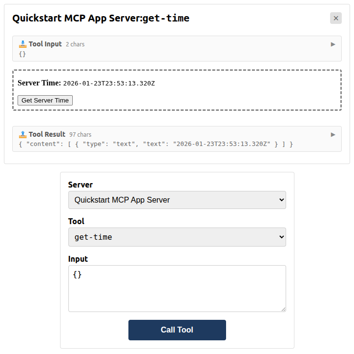

# Build Your First MCP App

This tutorial walks you through building an MCP App—a tool with an interactive **View** (a UI that renders inside an iframe) that displays in MCP hosts like Claude Desktop.

> [!TIP]
> Feel like vibe coding instead? Try the [MCP Apps agent skills](./agent-skills.md).

## What You'll Build

A simple app that fetches the current server time and displays it in an interactive View. You'll learn the core pattern: **MCP Apps = Tool + UI Resource**. The complete example is available in [`examples/quickstart`](https://github.com/modelcontextprotocol/ext-apps/tree/main/examples/quickstart).

## Prerequisites

This tutorial assumes you've built an MCP server before and are comfortable with [Tools](https://modelcontextprotocol.io/docs/learn/server-concepts#tools) and [Resources](https://modelcontextprotocol.io/docs/learn/server-concepts#resources). If not, the [official MCP quickstart](https://modelcontextprotocol.io/docs/develop/build-server) is a good place to start.

We'll use the [MCP TypeScript SDK](https://github.com/modelcontextprotocol/typescript-sdk) to build the server.

You'll also need Node.js 18+.

## 1. Set up the project

We'll set up a minimal TypeScript project with Vite for bundling.

Start by creating a project directory:

```bash
mkdir my-mcp-app && cd my-mcp-app
```

Install the dependencies you'll need:

```bash
npm init -y
npm install @modelcontextprotocol/ext-apps @modelcontextprotocol/sdk express cors
npm install -D typescript vite vite-plugin-singlefile @types/express @types/cors @types/node tsx concurrently cross-env
```

Configure your [`package.json`](https://github.com/modelcontextprotocol/ext-apps/blob/main/examples/quickstart/package.json):

```bash
npm pkg set type=module
npm pkg set scripts.build="tsc --noEmit && tsc -p tsconfig.server.json && cross-env INPUT=mcp-app.html vite build"
npm pkg set scripts.start="concurrently 'cross-env NODE_ENV=development INPUT=mcp-app.html vite build --watch' 'tsx watch main.ts'"
```

<details>
<summary>Create <a href="https://github.com/modelcontextprotocol/ext-apps/blob/main/examples/quickstart/tsconfig.json"><code>tsconfig.json</code></a>:</summary>

<!-- prettier-ignore -->
```json source="../examples/quickstart/tsconfig.json"
{
  "compilerOptions": {
    "target": "ESNext",
    "lib": ["ESNext", "DOM", "DOM.Iterable"],
    "module": "ESNext",
    "moduleResolution": "bundler",
    "allowImportingTsExtensions": true,
    "resolveJsonModule": true,
    "isolatedModules": true,
    "verbatimModuleSyntax": true,
    "noEmit": true,
    "strict": true,
    "skipLibCheck": true,
    "noUnusedLocals": true,
    "noUnusedParameters": true,
    "noFallthroughCasesInSwitch": true
  },
  "include": ["src", "server.ts", "main.ts"]
}
```

</details>

<details>
<summary>Create <a href="https://github.com/modelcontextprotocol/ext-apps/blob/main/examples/quickstart/tsconfig.server.json"><code>tsconfig.server.json</code></a> — for compiling server-side code:</summary>

<!-- prettier-ignore -->
```json source="../examples/quickstart/tsconfig.server.json"
{
  "compilerOptions": {
    "target": "ES2022",
    "lib": ["ES2022"],
    "module": "NodeNext",
    "moduleResolution": "NodeNext",
    "declaration": true,
    "emitDeclarationOnly": true,
    "outDir": "./dist",
    "rootDir": ".",
    "strict": true,
    "esModuleInterop": true,
    "skipLibCheck": true,
    "noUnusedLocals": true,
    "noUnusedParameters": true,
    "noFallthroughCasesInSwitch": true
  },
  "include": ["server.ts", "main.ts"]
}
```

</details>

<details>
<summary>Create <a href="https://github.com/modelcontextprotocol/ext-apps/blob/main/examples/quickstart/vite.config.ts"><code>vite.config.ts</code></a> — bundles UI into a single HTML file:</summary>

<!-- prettier-ignore -->
```ts source="../examples/quickstart/vite.config.ts"
import { defineConfig } from "vite";
import { viteSingleFile } from "vite-plugin-singlefile";

const INPUT = process.env.INPUT;
if (!INPUT) {
  throw new Error("INPUT environment variable is not set");
}

const isDevelopment = process.env.NODE_ENV === "development";

export default defineConfig({
  plugins: [viteSingleFile()],
  build: {
    sourcemap: isDevelopment ? "inline" : undefined,
    cssMinify: !isDevelopment,
    minify: !isDevelopment,

    rollupOptions: {
      input: INPUT,
    },
    outDir: "dist",
    emptyOutDir: false,
  },
});
```

</details>

Your `my-mcp-app` directory should now contain:

```
my-mcp-app/
├── package.json
├── tsconfig.json
├── tsconfig.server.json
└── vite.config.ts
```

With the project scaffolded, let's write the server code.

## 2. Register the tool and UI resource

MCP Apps use a **two-part registration**:

1. A **tool** that the LLM/host calls
2. A **resource** that contains the View HTML

The tool's `_meta` field links them together via the resource's URI. When an MCP Apps-capable host calls the tool, it will also read the resource and render the View.

Create [`server.ts`](https://github.com/modelcontextprotocol/ext-apps/blob/main/examples/quickstart/server.ts), which registers the tool and its UI resource:

<!-- prettier-ignore -->
```ts source="../examples/quickstart/server.ts"
import {
  registerAppResource,
  registerAppTool,
  RESOURCE_MIME_TYPE,
} from "@modelcontextprotocol/ext-apps/server";
import { McpServer } from "@modelcontextprotocol/sdk/server/mcp.js";
import fs from "node:fs/promises";
import path from "node:path";

const DIST_DIR = path.join(import.meta.dirname, "dist");

/**
 * Creates a new MCP server instance with tools and resources registered.
 */
export function createServer(): McpServer {
  const server = new McpServer({
    name: "Quickstart MCP App Server",
    version: "1.0.0",
  });

  // Two-part registration: tool + resource, tied together by the resource URI.
  const resourceUri = "ui://get-time/mcp-app.html";

  // Register a tool with UI metadata. When the host calls this tool, it reads
  // `_meta.ui.resourceUri` to know which resource to fetch and render as an
  // interactive UI.
  registerAppTool(
    server,
    "get-time",
    {
      title: "Get Time",
      description: "Returns the current server time.",
      inputSchema: {},
      _meta: { ui: { resourceUri } }, // Links this tool to its UI resource
    },
    async () => {
      const time = new Date().toISOString();
      return { content: [{ type: "text", text: time }] };
    },
  );

  // Register the resource, which returns the bundled HTML/JavaScript for the UI.
  registerAppResource(
    server,
    resourceUri,
    resourceUri,
    { mimeType: RESOURCE_MIME_TYPE },
    async () => {
      const html = await fs.readFile(path.join(DIST_DIR, "mcp-app.html"), "utf-8");

      return {
        contents: [
          { uri: resourceUri, mimeType: RESOURCE_MIME_TYPE, text: html },
        ],
      };
    },
  );

  return server;
}
```

<details>
<summary>Create <a href="https://github.com/modelcontextprotocol/ext-apps/blob/main/examples/quickstart/main.ts"><code>main.ts</code></a> — the entry point that starts the server:</summary>

<!-- prettier-ignore -->
```ts source="../examples/quickstart/main.ts"
import { createMcpExpressApp } from "@modelcontextprotocol/sdk/server/express.js";
import type { McpServer } from "@modelcontextprotocol/sdk/server/mcp.js";
import { StdioServerTransport } from "@modelcontextprotocol/sdk/server/stdio.js";
import { StreamableHTTPServerTransport } from "@modelcontextprotocol/sdk/server/streamableHttp.js";
import cors from "cors";
import type { Request, Response } from "express";
import { createServer } from "./server.js";

/**
 * Starts an MCP server with Streamable HTTP transport in stateless mode.
 *
 * @param createServer - Factory function that creates a new McpServer instance per request.
 */
export async function startStreamableHTTPServer(
  createServer: () => McpServer,
): Promise<void> {
  const port = parseInt(process.env.PORT ?? "3001", 10);

  const app = createMcpExpressApp({ host: "0.0.0.0" });
  app.use(cors());

  app.all("/mcp", async (req: Request, res: Response) => {
    const server = createServer();
    const transport = new StreamableHTTPServerTransport({
      sessionIdGenerator: undefined,
    });

    res.on("close", () => {
      transport.close().catch(() => {});
      server.close().catch(() => {});
    });

    try {
      await server.connect(transport);
      await transport.handleRequest(req, res, req.body);
    } catch (error) {
      console.error("MCP error:", error);
      if (!res.headersSent) {
        res.status(500).json({
          jsonrpc: "2.0",
          error: { code: -32603, message: "Internal server error" },
          id: null,
        });
      }
    }
  });

  const httpServer = app.listen(port, (err) => {
    if (err) {
      console.error("Failed to start server:", err);
      process.exit(1);
    }
    console.log(`MCP server listening on http://localhost:${port}/mcp`);
  });

  const shutdown = () => {
    console.log("\nShutting down...");
    httpServer.close(() => process.exit(0));
  };

  process.on("SIGINT", shutdown);
  process.on("SIGTERM", shutdown);
}

/**
 * Starts an MCP server with stdio transport.
 *
 * @param createServer - Factory function that creates a new McpServer instance.
 */
export async function startStdioServer(
  createServer: () => McpServer,
): Promise<void> {
  await createServer().connect(new StdioServerTransport());
}

async function main() {
  if (process.argv.includes("--stdio")) {
    await startStdioServer(createServer);
  } else {
    await startStreamableHTTPServer(createServer);
  }
}

main().catch((e) => {
  console.error(e);
  process.exit(1);
});
```

</details>

Your `my-mcp-app` directory should now contain:

```
my-mcp-app/
├── main.ts
├── package.json
├── server.ts
├── tsconfig.json
├── tsconfig.server.json
└── vite.config.ts
```

Let's verify everything compiles:

```bash
npx tsc --noEmit
```

No output means success! If you see errors, check for typos in `server.ts` or `main.ts`.

The server can return the current time when the tool is called. Now let's build the UI to display it.

## 3. Build the View

The View consists of an HTML page and a script that connects to the host.

Create [`mcp-app.html`](https://github.com/modelcontextprotocol/ext-apps/blob/main/examples/quickstart/mcp-app.html), the HTML for your View:

<!-- prettier-ignore -->
```html source="../examples/quickstart/mcp-app.html"
<!DOCTYPE html>
<html lang="en">
  <head>
    <meta charset="UTF-8" />
    <title>Get Time App</title>
  </head>
  <body>
    <p>
      <strong>Server Time:</strong> <code id="server-time">Loading...</code>
    </p>
    <button id="get-time-btn">Get Server Time</button>
    <script type="module" src="/src/mcp-app.ts"></script>
  </body>
</html>
```

Create [`src/mcp-app.ts`](https://github.com/modelcontextprotocol/ext-apps/blob/main/examples/quickstart/src/mcp-app.ts), which connects to the host and handles user interactions:

<!-- prettier-ignore -->
```ts source="../examples/quickstart/src/mcp-app.ts"
import { App } from "@modelcontextprotocol/ext-apps";

// Get element references
const serverTimeEl = document.getElementById("server-time")!;
const getTimeBtn = document.getElementById("get-time-btn")!;

// Create app instance
const app = new App({ name: "Get Time App", version: "1.0.0" });

// Handle tool results from the server. Set before `app.connect()` to avoid
// missing the initial tool result.
app.ontoolresult = (result) => {
  const time = result.content?.find((c) => c.type === "text")?.text;
  serverTimeEl.textContent = time ?? "[ERROR]";
};

// Wire up button click
getTimeBtn.addEventListener("click", async () => {
  // `app.callServerTool()` lets the UI request fresh data from the server
  const result = await app.callServerTool({ name: "get-time", arguments: {} });
  const time = result.content?.find((c) => c.type === "text")?.text;
  serverTimeEl.textContent = time ?? "[ERROR]";
});

// Connect to host
app.connect();
```

Your `my-mcp-app` directory should now contain:

```
my-mcp-app/
├── main.ts
├── mcp-app.html
├── package.json
├── server.ts
├── src/
│   └── mcp-app.ts
├── tsconfig.json
├── tsconfig.server.json
└── vite.config.ts
```

Now let's build the bundled View:

```bash
npm run build
```

This produces `dist/mcp-app.html`:

```console
$ ls dist/
mcp-app.html
```

The View will connect to the host, receive the tool result, and display it. Let's see it in action!

## 4. See it in action

You'll need two terminal windows.

**Terminal 1** — Start your server (with watch mode):

```bash
npm start
```

You should see:

```console
MCP server listening on http://localhost:3001/mcp
```

**Terminal 2** — Run the test host (from the [ext-apps repo](https://github.com/modelcontextprotocol/ext-apps)):

```bash
git clone https://github.com/modelcontextprotocol/ext-apps.git
cd ext-apps
npm install
cd examples/basic-host
npm start
```

Open http://localhost:8080 in your browser:

1. Select **get-time** from the "Tool Name" dropdown
2. Click **Call Tool**
3. Your View renders in the sandbox below
4. Click **Get Server Time** — the current time appears!



You've built your first MCP App!

## Next Steps

- **Continue learning**: The [`basic-server-vanillajs`](https://github.com/modelcontextprotocol/ext-apps/tree/main/examples/basic-server-vanillajs) example builds on this quickstart with host communication, theming, and lifecycle handlers
- **React version**: Compare with [`basic-server-react`](https://github.com/modelcontextprotocol/ext-apps/tree/main/examples/basic-server-react) for a React-based UI
- **Other frameworks**: See also [Vue](https://github.com/modelcontextprotocol/ext-apps/tree/main/examples/basic-server-vue), [Svelte](https://github.com/modelcontextprotocol/ext-apps/tree/main/examples/basic-server-svelte), [Preact](https://github.com/modelcontextprotocol/ext-apps/tree/main/examples/basic-server-preact), and [Solid](https://github.com/modelcontextprotocol/ext-apps/tree/main/examples/basic-server-solid) examples
- **API reference**: See the full [API documentation](https://modelcontextprotocol.github.io/ext-apps/api/)
