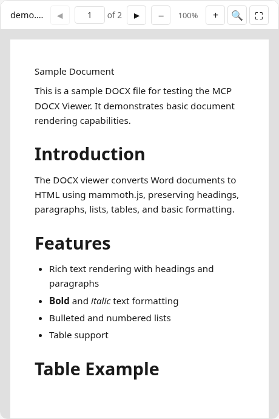

# DOCX Server



An interactive DOCX viewer using [mammoth.js](https://github.com/mwilliamson/mammoth.js) for server-side conversion. Renders Word documents as paginated HTML with search, zoom, and fullscreen support. Includes a built-in sample document for quick demos.

## MCP Client Configuration

Add to your MCP client configuration (stdio transport):

```json
{
  "mcpServers": {
    "docx": {
      "command": "npx",
      "args": [
        "-y",
        "--silent",
        "--registry=https://registry.npmjs.org/",
        "@modelcontextprotocol/server-docx",
        "--stdio"
      ]
    }
  }
}
```

### Local Development

To test local modifications, use this configuration (replace `~/code/ext-apps` with your clone path):

```json
{
  "mcpServers": {
    "docx": {
      "command": "bash",
      "args": [
        "-c",
        "cd ~/code/ext-apps/examples/docx-server && npm run build >&2 && node dist/index.js --stdio"
      ]
    }
  }
}
```

## What This Example Demonstrates

### 1. Server-Side Document Conversion

DOCX files are converted to HTML + plain text on the server using mammoth.js, then sent to the app for rendering:

**Server side** (`server.ts`):

```typescript
const result = await mammoth.convertToHtml({ buffer: docxBuffer });
const textResult = await mammoth.extractRawText({ buffer: docxBuffer });
return { html: result.value, text: textResult.value, messages };
```

**Client side** (`mcp-app.ts`):

```typescript
const content = await app.callServerTool({
  name: "read_docx_content",
  arguments: { url: docUrl },
});
docContentEl.innerHTML = content.html;
```

### 2. CSS Column Pagination

HTML content is paginated using CSS multi-column layout with a fixed-height viewport, avoiding nested scrolling:

```typescript
docContentEl.style.height = `${PAGE_HEIGHT}px`;
docContentEl.style.columnWidth = `${viewportWidth}px`;
// Navigate pages via translateX
docContentEl.style.transform = `translateX(${offset}px)`;
```

### 3. Model Context Updates

The viewer keeps the model informed about the current page and any selected text:

```typescript
app.updateModelContext({
  content: [
    {
      type: "text",
      text: `DOCX viewer | ${fileName} | Page: ${page}/${total}\n\n${content}`,
    },
  ],
});
```

### 4. Built-in Sample Document

A sample DOCX is generated on-the-fly from raw XML when no files are specified, so the demo works without any CLI arguments.

### 5. Dark Mode / Theming

The viewer syncs with the host's theme using CSS `light-dark()` and the SDK's theming APIs:

```typescript
app.onhostcontextchanged = (ctx) => {
  if (ctx.theme) applyDocumentTheme(ctx.theme);
  if (ctx.styles?.variables) applyHostStyleVariables(ctx.styles.variables);
};
```

## Usage

```bash
# Default: loads a built-in sample document
bun examples/docx-server/main.ts

# Load local DOCX files
bun examples/docx-server/main.ts ./report.docx /path/to/thesis.docx

# stdio mode for MCP clients
bun examples/docx-server/main.ts --stdio ./documents/report.docx
```

## Tools

| Tool                | Visibility | Purpose                     |
| ------------------- | ---------- | --------------------------- |
| `list_documents`    | Model      | List available DOCX files   |
| `display_docx`      | Model + UI | Display interactive viewer  |
| `read_docx_content` | App only   | Convert DOCX to HTML + text |

## Architecture

```
server.ts      # MCP server + tools + mammoth.js conversion
main.ts        # CLI entry point (HTTP + stdio)
src/
└── mcp-app.ts # Interactive viewer UI (pagination, search, zoom)
```

## Key Patterns Shown

| Pattern           | Implementation                              |
| ----------------- | ------------------------------------------- |
| App-only tools    | `_meta: { ui: { visibility: ["app"] } }`    |
| Server conversion | mammoth.js DOCX → HTML on server side       |
| CSS pagination    | Multi-column layout + translateX            |
| Model context     | `app.updateModelContext()`                  |
| Display modes     | `app.requestDisplayMode()`                  |
| Theming           | `applyDocumentTheme()` + CSS `light-dark()` |
| Built-in sample   | On-the-fly DOCX generation from raw XML     |

## Dependencies

- `mammoth`: DOCX to HTML conversion (server only)
- `@modelcontextprotocol/ext-apps`: MCP Apps SDK
