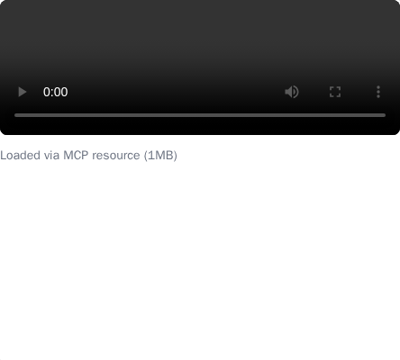

# Video Resource Server



Demonstrates serving binary content (video) via MCP resources using the base64 blob pattern.

## Quick Start

```bash
npm install
npm run dev
```

## Tools

- **play_video** - Plays a video loaded via MCP resource
  - `videoId`: Choose from various sizes (`bunny-1mb`, `bunny-5mb`, `bunny-10mb`, etc.)

## How It Works

1. The `play_video` tool returns a `videoUri` pointing to an MCP resource
2. The widget fetches the resource via `resources/read`
3. The server fetches the video from CDN and returns it as a base64 blob
4. The widget decodes the blob and plays it in a `<video>` element
