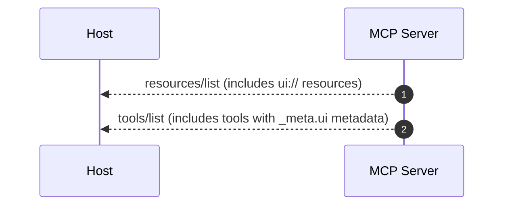
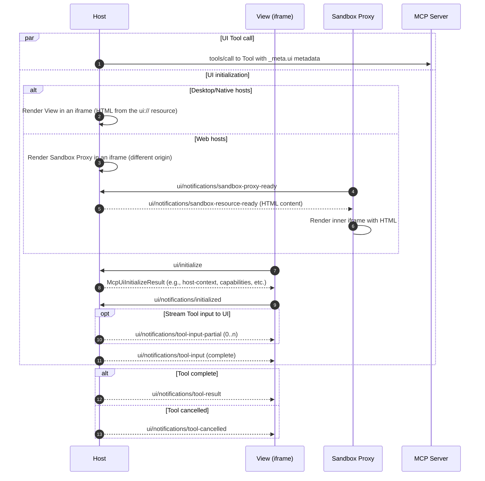
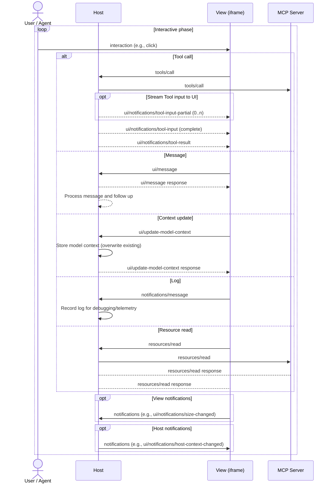
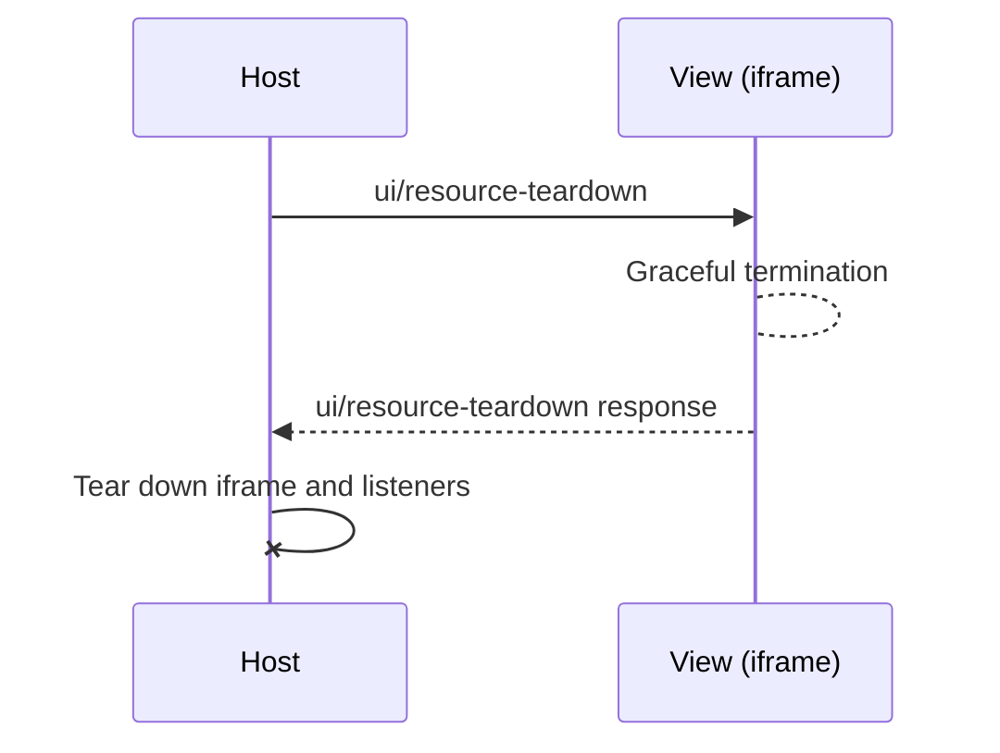

# SEP-1865: MCP Apps: Interactive User Interfaces for MCP

**Track:** Extensions

**Authors:** Ido Salomon, Liad Yosef, Olivier Chafik, Jerome Swannack, Jonathan Hefner, Anton Pidkuiko, Nick Cooper, Bryan Ashley, Alexi Christakis

**Status:** Draft

**Created:** 2025-11-21

## Abstract

This SEP proposes an extension (per SEP-1724) to MCP that enables servers to deliver interactive user interfaces to hosts. MCP Apps introduces a standardized pattern for declaring UI resources via the `ui://` URI scheme, associating them with tools through metadata, and facilitating bidirectional communication between the UI and the host using MCP's JSON-RPC base protocol. This extension addresses the growing community need for rich, interactive experiences in MCP-enabled applications, maintaining security, auditability, and alignment with MCP's core architecture. The initial specification focuses on HTML resources (`text/html;profile=mcp-app`) with a clear path for future extensions.

## Motivation

MCP lacks a standardized way for servers to deliver rich, interactive user interfaces to hosts. This gap blocks many use cases that require visual presentation and interactivity that goes beyond plain text or structured data. As more hosts adopt this capability, there's a growing risk of fragmentation and interoperability challenges.

[MCP-UI](https://mcpui.dev/) has demonstrated the viability and value of MCP apps built on UI resources and serves as a community playground for the UI spec and SDK. Fuelled by a dedicated community, it developed the bi-directional communication model and the HTML, external URL, and remote DOM content types. MCP-UI's adopters, including hosts and providers such as Postman, HuggingFace, Shopify, Goose, and ElevenLabs, have provided critical insights and contributions to the community.

OpenAI's Apps SDK, launched in November 2025, further validated the demand for rich UI experiences within conversational AI interfaces. The Apps SDK enables developers to build rich, interactive applications inside ChatGPT using MCP as its backbone.

The architecture of both the Apps SDK and MCP-UI have both significantly informed the design of this specification.

However, without formal standardization:

- Servers cannot reliably expect UI support via MCP
- Each host may implement slightly different behaviors
- Security and auditability patterns are inconsistent
- Developers must maintain separate implementations or adapters for different hosts (e.g., MCP-UI vs. Apps SDK)

This SEP addresses the current limitations through an optional, backwards-compatible extension that unifies the approaches pioneered by MCP-UI and the Apps SDK into a single, open standard.

## Specification

### Extension Identifier

This extension is identified as: `io.modelcontextprotocol/ui`

### Overview

MCP Apps extends the Model Context Protocol to enable servers to deliver interactive user interfaces to hosts. This extension introduces:

- **UI Resources:** Predeclared resources using the `ui://` URI scheme
- **Tool-UI Linkage:** Tools reference UI resources via metadata
- **Bidirectional Communication:** UI iframes communicate with hosts using standard MCP JSON-RPC protocol
- **Security Model:** Mandatory iframe sandboxing with auditable communication

This specification focuses on HTML content (`text/html;profile=mcp-app`) as the initial content type, with extensibility for future formats.

As an extension, MCP Apps is optional and must be explicitly negotiated between clients and servers through the extension capabilities mechanism (see Capability Negotiation section).

### UI Resource Format

UI resources are declared using the standard MCP resource pattern with specific conventions:

```typescript
interface UIResource {
  /**
   * Unique identifier for the UI resource
   *
   * MUST use the `ui://` URI scheme to distinguish UI resources from other
   * MCP resource types.
   *
   * @example
   * "ui://weather-dashboard"
   */
  uri: string;

  /**
   * Human-readable display name for the UI resource
   *
   * Used for listing and identifying the resource in host interfaces.
   *
   * @example
   * "Weather Dashboard"
   */
  name: string;

  /**
   * Optional description of the UI resource's purpose and functionality
   *
   * Provides context about what the UI does and when to use it.
   *
   * @example
   * "Interactive weather visualization with real-time updates"
   */
  description?: string;

  /**
   * MIME type of the UI content
   *
   * SHOULD be `text/html;profile=mcp-app` for HTML-based UIs in the initial MVP.
   * Other content types are reserved for future extensions.
   *
   * @example
   * "text/html;profile=mcp-app"
   */
  mimeType: string;

  /**
   * Resource metadata for security and rendering configuration
   *
   * Includes Content Security Policy configuration, dedicated domain settings,
   * and visual preferences.
   */
  _meta?: {
    ui?: UIResourceMeta;
  }
}

interface McpUiResourceCsp {
    /**
     * Origins for network requests (fetch/XHR/WebSocket)
     *
     * - Empty or omitted = no external connections (secure default)
     * - Maps to CSP `connect-src` directive
     *
     * @example
     * ["https://api.weather.com", "wss://realtime.service.com"]
     */
    connectDomains?: string[],
    /**
     * Origins for static resources (images, scripts, stylesheets, fonts, media)
     *
     * - Empty or omitted = no external resources (secure default)
     * - Wildcard subdomains supported: `https://*.example.com`
     * - Maps to CSP `img-src`, `script-src`, `style-src`, `font-src`, `media-src` directives
     *
     * @example
     * ["https://cdn.jsdelivr.net", "https://*.cloudflare.com"]
     */
    resourceDomains?: string[],
    /**
     * Origins for nested iframes
     *
     * - Empty or omitted = no nested iframes allowed (`frame-src 'none'`)
     * - Maps to CSP `frame-src` directive
     *
     * @example
     * ["https://www.youtube.com", "https://player.vimeo.com"]
     */
    frameDomains?: string[],
    /**
     * Allowed base URIs for the document
     *
     * - Empty or omitted = only same origin allowed (`base-uri 'self'`)
     * - Maps to CSP `base-uri` directive
     *
     * @example
     * ["https://cdn.example.com"]
     */
    baseUriDomains?: string[],
}

interface UIResourceMeta {
  /**
   * Content Security Policy configuration
   *
   * Servers declare which external origins their UI needs to access.
   * Hosts use this to enforce appropriate CSP headers.
   */
  csp?: McpUiResourceCsp,
  /**
   * Sandbox permissions requested by the UI
   *
   * Servers declare which browser capabilities their UI needs.
   * Hosts MAY honor these by setting appropriate iframe `allow` attributes.
   * Apps SHOULD NOT assume permissions are granted; use JS feature detection as fallback.
   */
  permissions?: {
    /**
     * Request camera access
     *
     * Maps to Permission Policy `camera` feature
     */
    camera?: {},
    /**
     * Request microphone access
     *
     * Maps to Permission Policy `microphone` feature
     */
    microphone?: {},
    /**
     * Request geolocation access
     *
     * Maps to Permission Policy `geolocation` feature
     */
    geolocation?: {},
    /**
     * Request clipboard write access
     *
     * Maps to Permission Policy `clipboard-write` feature
     */
    clipboardWrite?: {},
  },
  /**
   * Dedicated origin for view
   *
   * Optional domain for the view's sandbox origin. Useful when views need
   * stable, dedicated origins for OAuth callbacks, CORS policies, or API key allowlists.
   *
   * **Host-dependent:** The format and validation rules for this field are
   * determined by each host. Servers MUST consult host-specific documentation
   * for the expected domain format. Common patterns include:
   * - Hash-based subdomains (e.g., `{hash}.claudemcpcontent.com`)
   * - URL-derived subdomains (e.g., `www-example-com.oaiusercontent.com`)
   *
   * If omitted, Host uses default sandbox origin (typically per-conversation).
   *
   * @example
   * "a904794854a047f6.claudemcpcontent.com"
   * @example
   * "www-example-com.oaiusercontent.com"
   */
  domain?: string,
  /**
   * Visual boundary preference
   *
   * Boolean controlling whether a visible border and background is provided by the host. Specifying an
   * explicit value for this is recommended because hosts' defaults may vary.
   *
   * - `true`: Request visible border + background
   * - `false`: Request no visible border + background
   * - omitted: host decides border
   */
  prefersBorder?: boolean,
}
```

The resource content is returned via `resources/read`:

```typescript
// resources/read response for UI resource
{
  contents: [{
    uri: string;                  // Matching UI resource URI
    mimeType: "text/html;profile=mcp-app";  // MUST be "text/html;profile=mcp-app"
    text?: string;                // HTML content as string
    blob?: string;                // OR base64-encoded HTML
    _meta?: {
      ui?: {
        csp?: {
          connectDomains?: string[]; // Origins for network requests (fetch/XHR/WebSocket).
          resourceDomains?: string[]; // Origins for static resources (scripts, images, styles, fonts).
          frameDomains?: string[]; // Origins for nested iframes (frame-src directive).
          baseUriDomains?: string[]; // Allowed base URIs for the document (base-uri directive).
        };
        permissions?: {
          camera?: {};           // Request camera access
          microphone?: {};       // Request microphone access
          geolocation?: {};      // Request geolocation access
          clipboardWrite?: {};   // Request clipboard write access
        };
        domain?: string;
        prefersBorder?: boolean;
      };
    };
  }];
}
```

#### Content Requirements:

- URI MUST start with `ui://` scheme
- `mimeType` MUST be `text/html;profile=mcp-app` (other types reserved for future extensions)
- Content MUST be provided via either `text` (string) or `blob` (base64-encoded)
- Content MUST be valid HTML5 document

#### Host Behavior:

- **CSP Enforcement:** Host MUST construct CSP headers based on declared domains
- **Restrictive Default:** If `ui.csp` is omitted, Host MUST use:

  ```
  default-src 'none';
  script-src 'self' 'unsafe-inline';
  style-src 'self' 'unsafe-inline';
  img-src 'self' data:;
  media-src 'self' data:;
  connect-src 'none';
  ```

- **No Loosening:** Host MAY further restrict but MUST NOT allow undeclared domains
- **Audit Trail:** Host SHOULD log CSP configurations for security review

Example:

```json
// Resource declaration
{
  "uri": "ui://weather-server/dashboard-template",
  "name": "weather_dashboard",
  "description": "Interactive weather dashboard view",
  "mimeType": "text/html;profile=mcp-app"
}

// Resource content with metadata
{
  "contents": [{
    "uri": "ui://weather-server/dashboard-template",
    "mimeType": "text/html;profile=mcp-app",
    "text": "<!DOCTYPE html><html>...</html>",
    "_meta": {
      "ui" : {
        "csp": {
          "connectDomains": ["https://api.openweathermap.org"],
          "resourceDomains": ["https://cdn.jsdelivr.net"]
        },
        "prefersBorder": true
      }
    }
  }]
}
```

### Resource Discovery

Tools are associated with UI resources through the `_meta.ui` field:

```typescript
interface McpUiToolMeta {
  /** URI of UI resource for rendering tool results */
  resourceUri?: string;
  /**
   * Who can access this tool. Default: ["model", "app"]
   * - "model": Tool visible to and callable by the agent
   * - "app": Tool callable by the app from this server only
   */
  visibility?: Array<"model" | "app">;
}

interface Tool {
  name: string;
  description: string;
  inputSchema: object;
  _meta?: {
    ui?: McpUiToolMeta;
    /** @deprecated Use `ui.resourceUri` instead. Will be removed before GA. */
    "ui/resourceUri"?: string;
  };
}
```

> **Deprecation notice:** The flat `_meta["ui/resourceUri"]` format is deprecated. Use `_meta.ui.resourceUri` instead. The deprecated format will be removed before GA.

Example (tool visible to both model and app):

```json
{
  "name": "get_weather",
  "description": "Get current weather for a location",
  "inputSchema": {
    "type": "object",
    "properties": {
      "location": { "type": "string" }
    }
  },
  "_meta": {
    "ui": {
      "resourceUri": "ui://weather-server/dashboard-template",
      "visibility": ["model", "app"]
    }
  }
}
```

Example (app-only tool, hidden from model):

```json
{
  "name": "refresh_dashboard",
  "description": "Refresh dashboard data",
  "inputSchema": { "type": "object" },
  "_meta": {
    "ui": {
      "resourceUri": "ui://weather-server/dashboard-template",
      "visibility": ["app"]
    }
  }
}
```

#### Behavior:

- If `ui.resourceUri` is present and host supports MCP Apps, host renders tool results using the specified UI resource
- If host does not support MCP Apps, tool behaves as standard tool (text-only fallback)
- Resource MUST exist on the server
- Host MUST use `resources/read` to fetch the referenced resource URI
- Host MAY prefetch and cache UI resource content for performance optimization
- Since UI resources are primarily discovered through tool metadata, Servers MAY omit UI-only resources from `resources/list` and `notifications/resources/list_changed`

#### Visibility:

- `visibility` defaults to `["model", "app"]` if omitted
- `"model"`: Tool is visible to and callable by the agent
- `"app"`: Tool is callable by the app from the same server connection only
- **tools/list behavior:** Host MUST NOT include tools in the agent's tool list when their visibility does not include `"model"` (e.g., `visibility: ["app"]`)
- **tools/call behavior:** Host MUST reject `tools/call` requests from apps for tools that don't include `"app"` in visibility
- Cross-server tool calls are always blocked for app-only tools

#### Benefits:

- **Performance:** Host can preload templates before tool execution
- **Security:** Host can review UI templates during connection setup
- **Caching:** Separate template (static) from data (dynamic)
- **Auditability:** All UI resources are enumerable and inspectable

### Communication Protocol

MCP Apps uses JSON-RPC 2.0 over `postMessage` for iframe-host communication. UI capabilities (e.g., tool call, prompt, etc.) will reuse MCP’s existing protocol. In the future, we may choose to enrich the communication protocol with additional MCP capabilities.

### Transport Layer

Conceptually, UI iframes act as MCP clients, connecting to the host via a `postMessage` transport:

```typescript
// UI iframe initializes MCP client
const transport = new MessageTransport(window.parent);
const client = new Client({ name: "ui-view", version: "1.0.0" });
await client.connect(transport);
```

Note that you don’t need an SDK to “talk MCP” with the host:

```typescript
let nextId = 1;
function sendRequest(method: string, params: any) {
  const id = nextId++;
  window.parent.postMessage({ jsonrpc: "2.0", id, method, params }, '*');
  return new Promise((resolve, reject) => {
    window.addEventListener('message', function listener(event) {
      const data: JSONRPCMessage = event.data;
      if (event.data?.id === id) {
        window.removeEventListener('message', listener);
        if (event.data?.result) {
          resolve(event.data?.result);
        } else if (event.data?.error) {
          reject(new Error(event.data.error));
        }
      } else {
        reject(new Error(`Unsupported message: ${JSON.stringify(data)}`));
      }
    });
  });
}
function sendNotification(method: string, params: any) {
  window.parent.postMessage({ jsonrpc: "2.0", method, params }, '*');
}
function onNotification(method: string, handler: (params: any) => void) {
  window.addEventListener('message', function listener(event) {
    if (event.data?.method === method) {
      handler(event.data.params);
    }
  });
}


const initializeResult = await sendRequest("initialize", {
  capabilities: {},
  clientInfo: {name: "My UI", version: "1.0.0"},
  protocolVersion: "2025-06-18",
});
```

Hosts act as MCP servers (that can proxy the actual MCP server), receiving and handling requests from UI iframes.

### Sandbox proxy

If the Host is a web page, it MUST wrap the View and communicate with it through an intermediate Sandbox proxy.

1. The Host and the Sandbox MUST have different origins.
2. The Sandbox MUST have the following permissions: `allow-scripts`, `allow-same-origin`.
3. The Sandbox MUST send a `ui/notifications/sandbox-proxy-ready` notification to the host when it's ready to process an `ui/notifications/sandbox-resource-ready` notification.
4. Once the Sandbox is ready, the Host MUST send the raw HTML resource to load in a `ui/notifications/sandbox-resource-ready` notification.
5. The Sandbox MUST load the raw HTML of the View with CSP settings that:
   - Enforce the domains declared in `ui.csp` metadata
   - If `frameDomains` is provided, allow nested iframes from declared origins; otherwise use `frame-src 'none'`
   - If `baseUriDomains` is provided, allow base URIs from declared origins; otherwise use `base-uri 'self'`
   - Block dangerous features (`object-src 'none'`)
   - Apply restrictive defaults if no CSP metadata is provided
   - If `permissions` is declared, the Sandbox MAY set the inner iframe's `allow` attribute accordingly
6. The Sandbox MUST forward messages sent by the Host to the View, and vice versa, for any method that doesn't start with `ui/notifications/sandbox-`. This includes lifecycle messages, e.g., `ui/initialize` request & `ui/notifications/initialized` notification both sent by the View. The Host MUST NOT send any request or notification to the View before it receives an `initialized` notification.
7. The Sandbox SHOULD NOT create/send any requests to the Host or to the View (this would require synthesizing new request ids).
8. The Host MAY forward any message from the View (coming via the Sandbox) to the MCP Apps server, for any method that doesn't start with `ui/`. While the Host SHOULD ensure the View's MCP connection is spec-compliant, it MAY decide to block some messages or subject them to further user approval.

### Standard MCP Messages

UI iframes can use the following subset of standard MCP protocol messages.

Note that `tools/call` and `tools/list` flow **bidirectionally**:
- **App → Host → Server**: Apps call server tools (requires host `serverTools` capability)
- **Host → App**: Host calls app-registered tools (requires app `tools` capability)

**Tools:**

- `tools/call` - Execute a tool (bidirectional)
  - **App → Host**: Call server tool via host proxy
  - **Host → App**: Call app-registered tool
- `tools/list` - List available tools (bidirectional)
  - **App → Host**: List server tools
  - **Host → App**: List app-registered tools
- `notifications/tools/list_changed` - Notify when tool list changes (bidirectional)
  - **Server → Host → App**: Server tools changed
  - **App → Host**: App-registered tools changed

**Resources:**

- `resources/read` - Read resource content

**Notifications:**

- `notifications/message` - Log messages to host

**Lifecycle:**

- `ui/initialize` → `ui/notifications/initialized` - MCP-like handshake (replaces custom iframe-ready pattern in MCP-UI)
- `ping` - Connection health check

### App Capabilities in `ui/initialize`

When the View sends an `ui/initialize` request to the Host, it MUST include its capabilities in the `appCapabilities` field:

```typescript
interface McpUiAppCapabilities {
  /** Experimental features (structure TBD). */
  experimental?: {};
  /** App exposes MCP-style tools that the host can call. */
  tools?: {
    /** App supports tools/list_changed notifications. */
    listChanged?: boolean;
  };
  /**
   * Display modes the app supports. See Display Modes section for details.
   * @example ["inline", "fullscreen"]
   */
  availableDisplayModes?: Array<"inline" | "fullscreen" | "pip">;
}
```

### Host Context in `McpUiInitializeResult`

When the View sends an `ui/initialize` request to the Host, the Host SHOULD include UI-specific context in the `McpUiInitializeResult`'s `hostContext` field:

```typescript
interface HostContext {
  /** Metadata of the tool call that instantiated the View */
  toolInfo?: {
    /** JSON-RPC id of the tools/call request */
    id?: RequestId,
    /** Contains name, inputSchema, etc… */
    tool: Tool,
  };
  /** Current color theme preference */
  theme?: "light" | "dark";
  /** Style configuration for theming. See Theming section for standardized variable names. */
  styles?: {
    /** CSS variables for theming */
    variables?: Record<McpUiStyleVariableKey, string | undefined>;
    /** CSS blocks that Views can inject */
    css?: {
      /** CSS for font loading (@font-face rules or @import statements) */
      fonts?: string;
    };
  };
  /** How the View is currently displayed */
  displayMode?: "inline" | "fullscreen" | "pip";
  /** Display modes the host supports */
  availableDisplayModes?: string[];
  /** Container dimensions for the iframe. Specify either width or maxWidth, and either height or maxHeight. */
  containerDimensions?: (
    | { height: number }      // If specified, container is fixed at this height
    | { maxHeight?: number }  // Otherwise, container height is determined by the View's height, up to this maximum height (if defined)
  ) & (
    | { width: number }       // If specified, container is fixed at this width
    | { maxWidth?: number }   // Otherwise, container width is determined by the View's width, up to this maximum width (if defined)
  );
  /** User's language/region preference (BCP 47, e.g., "en-US") */
  locale?: string;
  /** User's timezone (IANA, e.g., "America/New_York") */
  timeZone?: string;
  /** Host application identifier */
  userAgent?: string;
  /** Platform type for responsive design */
  platform?: "web" | "desktop" | "mobile";
  /** Device capabilities such as touch */
  deviceCapabilities?: {
    touch?: boolean;
    hover?: boolean;
  }
  /** Safe area boundaries in pixels */
  safeAreaInsets?: {
    top: number;
    right: number;
    bottom: number;
    left: number;
  };
}
```

Example:

```json
// Host responds with McpUiInitializeResult
{
  "jsonrpc": "2.0",
  "id": 1,
  "result": {
    "protocolVersion": "2025-06-18",
    "hostCapabilities": { /* ... */ },
    "hostInfo": { "name": "claude-desktop", "version": "1.0.0" },
    "hostContext": {
      "theme": "dark",
      "styles": {
        "variables": {
          "--color-background-primary": "light-dark(#ffffff, #171717)",
          "--color-text-primary": "light-dark(#171717, #fafafa)",
          "--font-sans": "Anthropic Sans, sans-serif",
          ...
        },
        "css": {
          "fonts": "@font-face { font-family: \"Custom Font Name\"; src: url(\"https://...\"); }"
        }
      },
      "displayMode": "inline",
      "containerDimensions": { "width": 400, "maxHeight": 600 }
    }
  }
}
```

### Host Capabilities

`HostCapabilities` are sent to the View as part of the response to `ui/initialize` (inside `McpUiInitializeResult`).
They describe the features and capabilities that the Host supports.

```typescript
interface HostCapabilities {
  /** Experimental features (structure TBD). */
  experimental?: {};
  /** Host supports opening external URLs. */
  openLinks?: {};
  /** Host can proxy tool calls to the MCP server. */
  serverTools?: {
    /** Host supports tools/list_changed notifications. */
    listChanged?: boolean;
  };
  /** Host can proxy resource reads to the MCP server. */
  serverResources?: {
    /** Host supports resources/list_changed notifications. */
    listChanged?: boolean;
  };
  /** Host accepts log messages. */
  logging?: {};
  /** Sandbox configuration applied by the host. */
  sandbox?: {
    /** Permissions granted by the host (camera, microphone, geolocation, clipboard-write). */
    permissions?: {
      camera?: {};
      microphone?: {};
      geolocation?: {};
      clipboardWrite?: {};
    };
    /** CSP domains approved by the host. */
    csp?: {
      /** Approved origins for network requests (fetch/XHR/WebSocket). */
      connectDomains?: string[];
      /** Approved origins for static resources (scripts, images, styles, fonts). */
      resourceDomains?: string[];
      /** Approved origins for nested iframes (frame-src directive). */
      frameDomains?: string[];
      /** Approved base URIs for the document (base-uri directive). */
      baseUriDomains?: string[];
    };
  };
}
```

### Container Dimensions

The `HostContext` provides sizing information via `containerDimensions`:

- **`containerDimensions`**: The dimensions of the container that holds the View. This controls the actual space the View occupies within the host. Each dimension (height and width) operates independently and can be either **fixed** or **flexible**.

#### Dimension Modes

| Mode | Dimensions Field | Meaning |
|------|-----------------|---------|
| Fixed | `height` or `width` | Host controls the size. View should fill the available space. |
| Flexible | `maxHeight` or `maxWidth` | View controls the size, up to the specified maximum. |
| Unbounded | Field omitted | View controls the size with no limit. |

These modes can be combined independently. For example, a host might specify a fixed width but flexible height, allowing the View to grow vertically based on content.

#### View Behavior

Views should check the containerDimensions configuration and apply appropriate CSS:

```typescript
// In the View's initialization
const containerDimensions = hostContext.containerDimensions;

if (containerDimensions) {
  // Handle height
  if ("height" in containerDimensions) {
    // Fixed height: fill the container
    document.documentElement.style.height = "100vh";
  } else if ("maxHeight" in containerDimensions && containerDimensions.maxHeight) {
    // Flexible with max: let content determine size, up to max
    document.documentElement.style.maxHeight = `${containerDimensions.maxHeight}px`;
  }
  // If neither, height is unbounded

  // Handle width
  if ("width" in containerDimensions) {
    // Fixed width: fill the container
    document.documentElement.style.width = "100vw";
  } else if ("maxWidth" in containerDimensions && containerDimensions.maxWidth) {
    // Flexible with max: let content determine size, up to max
    document.documentElement.style.maxWidth = `${containerDimensions.maxWidth}px`;
  }
  // If neither, width is unbounded
}
```

#### Host Behavior

When using flexible dimensions (no fixed `height` or `width`), hosts MUST listen for `ui/notifications/size-changed` notifications from the View and update the iframe dimensions accordingly:

```typescript
// Host listens for size changes from the View
bridge.onsizechange = ({ width, height }) => {
  // Update iframe to match View's content size
  if (width != null) {
    iframe.style.width = `${width}px`;
  }
  if (height != null) {
    iframe.style.height = `${height}px`;
  }
};
```

Views using the SDK automatically send size-changed notifications via ResizeObserver when `autoResize` is enabled (the default). The notifications are debounced and only sent when dimensions actually change.

### Display Modes

Views can be displayed in different modes depending on the host's capabilities and the view's declared support.

```typescript
type McpUiDisplayMode = "inline" | "fullscreen" | "pip";
```

- **inline**: Default mode, embedded within the host's content flow
- **fullscreen**: View takes over the full screen/window
- **pip**: Picture-in-picture, floating overlay

#### Declaring Support

**View (`appCapabilities.availableDisplayModes`):**

Views declare which display modes they support in the `ui/initialize` request via `appCapabilities.availableDisplayModes`. This allows hosts to only offer display mode options that the view can handle.

```typescript
// Example: View declares support for inline and fullscreen
{
  method: "ui/initialize",
  params: {
    appCapabilities: {
      availableDisplayModes: ["inline", "fullscreen"]
    },
    // ...
  }
}
```

**Host (`HostContext.availableDisplayModes`):**

Hosts declare which display modes they support in `HostContext.availableDisplayModes`. Views should check this before requesting a mode change.

#### Requesting Changes

Views request display mode changes via `ui/request-display-mode`. See the Requests section for message format.

#### Notifying Changes

Hosts notify views of display mode changes via `ui/notifications/host-context-changed` with the `displayMode` field.

#### Requirements

**View behavior:**
- View MUST declare all display modes it supports in `appCapabilities.availableDisplayModes` during initialization.
- View MUST check if the requested mode is in `availableDisplayModes` from host context before requesting a mode change.
- View MUST handle the response mode differing from the requested mode.

**Host behavior:**
- Host MUST NOT switch the View to a display mode that does not appear in its `appCapabilities.availableDisplayModes`, if set.
- Host MUST return the resulting mode (whether updated or not) in the response to `ui/request-display-mode`.
- If the requested mode is not available, Host SHOULD return the current display mode in the response.
- Host MAY decline display mode requests from Views that did not declare said modes in their capabilities.

### Theming

Hosts can optionally pass CSS custom properties via `HostContext.styles.variables` for visual cohesion with the host environment.

#### Current Standardized Variables

```typescript
/** CSS variable keys available to Views for theming. */
type McpUiStyleVariableKey =
  // Background colors
  | "--color-background-primary"
  | "--color-background-secondary"
  | "--color-background-tertiary"
  | "--color-background-inverse"
  | "--color-background-ghost"
  | "--color-background-info"
  | "--color-background-danger"
  | "--color-background-success"
  | "--color-background-warning"
  | "--color-background-disabled"
  // Text colors
  | "--color-text-primary"
  | "--color-text-secondary"
  | "--color-text-tertiary"
  | "--color-text-inverse"
  | "--color-text-info"
  | "--color-text-danger"
  | "--color-text-success"
  | "--color-text-warning"
  | "--color-text-disabled"
  | "--color-text-ghost"
  // Border colors
  | "--color-border-primary"
  | "--color-border-secondary"
  | "--color-border-tertiary"
  | "--color-border-inverse"
  | "--color-border-ghost"
  | "--color-border-info"
  | "--color-border-danger"
  | "--color-border-success"
  | "--color-border-warning"
  | "--color-border-disabled"
  // Ring colors
  | "--color-ring-primary"
  | "--color-ring-secondary"
  | "--color-ring-inverse"
  | "--color-ring-info"
  | "--color-ring-danger"
  | "--color-ring-success"
  | "--color-ring-warning"
  // Typography - Family
  | "--font-sans"
  | "--font-mono"
  // Typography - Weight
  | "--font-weight-normal"
  | "--font-weight-medium"
  | "--font-weight-semibold"
  | "--font-weight-bold"
  // Typography - Text Size
  | "--font-text-xs-size"
  | "--font-text-sm-size"
  | "--font-text-md-size"
  | "--font-text-lg-size"
  // Typography - Heading Size
  | "--font-heading-xs-size"
  | "--font-heading-sm-size"
  | "--font-heading-md-size"
  | "--font-heading-lg-size"
  | "--font-heading-xl-size"
  | "--font-heading-2xl-size"
  | "--font-heading-3xl-size"
  // Typography - Text Line Height
  | "--font-text-xs-line-height"
  | "--font-text-sm-line-height"
  | "--font-text-md-line-height"
  | "--font-text-lg-line-height"
  // Typography - Heading Line Height
  | "--font-heading-xs-line-height"
  | "--font-heading-sm-line-height"
  | "--font-heading-md-line-height"
  | "--font-heading-lg-line-height"
  | "--font-heading-xl-line-height"
  | "--font-heading-2xl-line-height"
  | "--font-heading-3xl-line-height"
  // Border radius
  | "--border-radius-xs"
  | "--border-radius-sm"
  | "--border-radius-md"
  | "--border-radius-lg"
  | "--border-radius-xl"
  | "--border-radius-full"
  // Border width
  | "--border-width-regular"
  // Shadows
  | "--shadow-hairline"
  | "--shadow-sm"
  | "--shadow-md"
  | "--shadow-lg";
```

#### Host Behavior

- Hosts can provide any subset of standardized variables, or not pass `styles` at all
  - However, unexpected clashes may occur if hosts pass some color variables but not others for example, since Views are instructed to fallback on their own default values for unspecified style variables
- Hosts should use the CSS `light-dark()` function for theme-aware values (i.e. light mode and dark mode colors)

#### View Behavior

- Views should set default fallback values for the set of these variables that they use, to account for hosts who don't pass some or all style variables. This ensures graceful degradation when hosts omit `styles` or specific variables:
```
:root {
  --color-text-primary: light-dark(#171717, #000000);
  --border-radius-small: 8px;
  ...
}
```
- Views can use the `applyHostStyleVariables` utility (or `useHostStyleVariables` if they prefer a React hook) to easily populate the host-provided CSS variables into their style sheet
- Views can use the `applyDocumentTheme` utility (or `useDocumentTheme` if they prefer a React hook) to easily respond to Host Context `theme` changes in a way that is compatible with the host's light/dark color variables 

Example usage of standardized CSS variables:

```css
.container {
  background: var(--color-background-primary);
  color: var(--color-text-primary);
  font-family: var(--font-sans);
}
```

#### Custom Fonts

Hosts can provide custom fonts via `styles.css.fonts`, which can contain `@font-face` rules for self-hosted fonts, `@import` statements for font services like Google Fonts, or both:

```typescript
hostContext.styles.variables["--font-sans"] = '"Font Name", sans-serif';

// Self-hosted fonts
hostContext.styles.css.fonts = `
  @font-face {
    font-family: "Font Name";
    src: url("https://url-where-font-is-hosted.com/.../Regular.otf") format("opentype");
    font-weight: 400;
    font-style: normal;
    font-display: swap;
  }
  @font-face {
    font-family: "Font Name";
    src: url("https://url-where-font-is-hosted.com/.../Medium.otf") format("opentype");
    font-weight: 500;
    font-style: medium;
    font-display: swap;
  }
`;

// Google Fonts
hostContext.styles.css.fonts = `
  @import url('https://fonts.googleapis.com/css2?family=Font+Name&display=swap');
`;
```

Views can use the `applyHostFonts` utility to inject the font CSS into the document:

```typescript
if (hostContext.styles?.css?.fonts) {
  applyHostFonts(hostContext.styles.css.fonts);
}
```

### MCP Apps Specific Messages

MCP Apps introduces additional JSON-RPC methods for UI-specific functionality:

#### Requests (View → Host)

`ui/open-link` - Request host to open external URL

```typescript
// Request
{
  jsonrpc: "2.0",
  id: 1,
  method: "ui/open-link",
  params: {
    url: string  // URL to open in host's browser
  }
}

// Success Response
{
  jsonrpc: "2.0",
  id: 1,
  result: {}  // Empty result on success
}

// Error Response (if denied or failed)
{
  jsonrpc: "2.0",
  id: 1,
  error: {
    code: -32000,  // Implementation-defined error
    message: "Link opening denied by user" | "Invalid URL" | "Policy violation"
  }
}
```

Host SHOULD open the URL in the user's default browser or a new tab.

`ui/message` - Send message content to the host's chat interface

```typescript
// Request
{
  jsonrpc: "2.0",
  id: 2,
  method: "ui/message",
  params: {
    role: "user",
    content: {
      type: "text",
      text: string
    }
  }
}

// Success Response
{
  jsonrpc: "2.0",
  id: 2,
  result: {}  // Empty result on success
}

// Error Response (if denied or failed)
{
  jsonrpc: "2.0",
  id: 2,
  error: {
    code: -32000,  // Implementation-defined error
    message: "Message sending denied" | "Invalid message format"
  }
}
```
Host behavior:
* Host SHOULD add the message to the conversation context, preserving the specified role.
* Host MAY request user consent.

`ui/request-display-mode` - Request host to change display mode

```typescript
// Request
{
  jsonrpc: "2.0",
  id: 3,
  method: "ui/request-display-mode",
  params: {
    mode: "inline" | "fullscreen" | "pip"  // Requested display mode
  }
}

// Success Response
{
  jsonrpc: "2.0",
  id: 3,
  result: {
    mode: "inline" | "fullscreen" | "pip"  // Actual display mode set
  }
}
```

See the Display Modes section for detailed behavior requirements.

`ui/update-model-context` - Update the model context

```typescript
// Request
{
  jsonrpc: "2.0",
  id: 3,
  method: "ui/update-model-context",
  params: {
    content?: ContentBlock[],
    structuredContent?: Record<string, unknown>
  }
}

// Success Response
{
  jsonrpc: "2.0",
  id: 3,
  result: {}  // Empty result on success
}

// Error Response (if denied or failed)
{
  jsonrpc: "2.0",
  id: 3,
  error: {
    code: -32000,  // Implementation-defined error
    message: "Context update denied" | "Invalid content format"
  }
}
```

The View MAY send this request to update the Host's model context. This context will be used in future turns. Each request overwrites the previous context sent by the View.
This event serves a different use case from `notifications/message` (logging) and `ui/message` (which also trigger follow-ups).

Host behavior:
- SHOULD provide the context to the model in future turns
- MAY overwrite the previous model context with the new update
- MAY defer sending the context to the model until the next user message (including `ui/message`)
- MAY dedupe identical `ui/update-model-context` calls
- If multiple updates are received before the next user message, Host SHOULD only send the last update to the model
- MAY display context updates to the user

#### Requests (Host → App)

When Apps declare the `tools` capability, the Host can send standard MCP tool requests to the App:

`tools/call` - Execute an App-registered tool

```typescript
// Request (Host → App)
{
  jsonrpc: "2.0",
  id: 1,
  method: "tools/call",
  params: {
    name: string,        // Name of app-registered tool to execute
    arguments?: object   // Tool arguments (validated against inputSchema)
  }
}

// Success Response (App → Host)
{
  jsonrpc: "2.0",
  id: 1,
  result: {
    content: Array<ContentBlock>,  // Result for model context
    structuredContent?: object,    // Optional structured data for UI
    isError?: boolean,             // True if tool execution failed
    _meta?: object                 // Optional metadata
  }
}

// Error Response
{
  jsonrpc: "2.0",
  id: 1,
  error: {
    code: number,
    message: string
  }
}
```

**App Behavior:**
- Apps MUST implement `oncalltool` handler if they declare `tools` capability
- Apps SHOULD validate tool names and arguments
- Apps MAY use `app.registerTool()` SDK helper for automatic validation
- Apps SHOULD return `isError: true` for tool execution failures

`tools/list` - List App-registered tools

```typescript
// Request (Host → App)
{
  jsonrpc: "2.0",
  id: 2,
  method: "tools/list",
  params: {
    cursor?: string  // Optional pagination cursor
  }
}

// Response (App → Host)
{
  jsonrpc: "2.0",
  id: 2,
  result: {
    tools: Array<Tool>,  // List of available tools
    nextCursor?: string  // Pagination cursor if more tools exist
  }
}
```

**Tool Structure:**
```typescript
interface Tool {
  name: string;                    // Unique tool identifier
  description?: string;            // Human-readable description
  inputSchema: object;             // JSON Schema for arguments
  annotations?: ToolAnnotations;   // MCP tool annotations (e.g., readOnlyHint)
}
```

**App Behavior:**
- Apps MUST implement `onlisttools` handler if they declare `tools` capability
- Apps SHOULD return complete tool metadata including schemas
- Apps MAY filter tools based on context or permissions

#### Notifications (Host → View)

`ui/notifications/tool-input` - Host MUST send this notification with the complete tool arguments after the View's initialize request completes.

```typescript
{
  jsonrpc: "2.0",
  method: "ui/notifications/tool-input",
  params: {
    arguments: Record<string, unknown>  // Tool input arguments
  }
}
```

Host sends this notification after the View's initialize request completes, when tool arguments become available. This notification is sent at most once and is required before sending `ui/notifications/tool-result`.

`ui/notifications/tool-input-partial` - Host MAY send this notification zero or more times while the agent is streaming tool arguments, before `ui/notifications/tool-input` is sent.

```typescript
{
  jsonrpc: "2.0",
  method: "ui/notifications/tool-input-partial",
  params: {
    arguments: Record<string, unknown>  // Tool input arguments
  }
}
```

The arguments object represents best-effort recovery of incomplete JSON, with unclosed structures automatically closed to produce valid JSON. Host behavior (optional):

- MAY parse the agent's partial JSON output by closing unclosed brackets/braces
- MAY send recovered arguments as they become available during streaming
- MUST stop sending once `ui/notifications/tool-input` is sent with complete arguments

View behavior (optional):

- MAY ignore these notifications entirely
- MAY render progressive loading/streaming states based on available fields
- MUST NOT rely on partial arguments for critical operations
- SHOULD gracefully handle missing or changing fields between notifications

`ui/notifications/tool-result` - Tool execution result

```typescript
{
  jsonrpc: "2.0",
  method: "ui/notifications/tool-result",
  params: CallToolResult  // Standard MCP type
}
```

Host MUST send this notification when tool execution completes (if the View is displayed during tool execution).

`ui/notifications/tool-cancelled` - Tool execution was cancelled

```typescript
{
  jsonrpc: "2.0",
  method: "ui/notifications/tool-cancelled",
  params: {
    reason: string
  }
}
```

Host MUST send this notification if the tool execution was cancelled, for any reason (which can optionally be specified), including user action, sampling error, classifier intervention, etc.

`ui/resource-teardown` - Host notifies View before teardown

```typescript
{
  jsonrpc: "2.0",
  id: 1,
  method: "ui/resource-teardown",
  params: {
    reason: string
  }
}

// Success Response
{
  jsonrpc: "2.0",
  id: 1,
  result: {}  // Empty result on success
}

// Error Response (if failed)
{
  jsonrpc: "2.0",
  id: 1,
  error: {
    code: -32000,  // Implementation-defined error
    message: "Teardown error"
  }
}
```

Host MUST send this notification before tearing down the UI resource, for any reason, including user action, resource re-allocation, etc. The Host MAY specify the reason.
Host SHOULD wait for a response before tearing down the resource (to prevent data loss).

`ui/notifications/size-changed` - View's size changed

```typescript
{
  jsonrpc: "2.0",
  method: "ui/notifications/size-changed",
  params: {
    width: number,   // Viewport width in pixels
    height: number   // Viewport height in pixels
  }
}
```

The View SHOULD send this notification when rendered content body size changes (e.g. using ResizeObserver API to report up to date size).

`ui/notifications/host-context-changed` - Host context has changed

```typescript
{
  jsonrpc: "2.0",
  method: "ui/notifications/host-context-changed",
  params: Partial<HostContext>  // See HostContext type above
}
```

Host MAY send this notification when any context field changes (e.g., theme toggle, display mode change, device orientation change, window/panel resize). This notification contains partial updates - the View SHOULD merge received fields with its current context state.

#### Reserved Messages (Sandbox Proxy)

These messages are reserved for web-based hosts that implement the recommended double-iframe sandbox architecture:

`ui/notifications/sandbox-proxy-ready` (Sandbox Proxy → Host) - Sandbox proxy is ready

```typescript
{
  jsonrpc: "2.0",
  method: "ui/notifications/sandbox-proxy-ready",
  params: {}
}
```

`ui/notifications/sandbox-resource-ready` (Host → Sandbox Proxy) - HTML resource ready to load

```typescript
{
  jsonrpc: "2.0",
  method: "ui/notifications/sandbox-resource-ready",
  params: {
    html: string,        // HTML content to load
    sandbox?: string,    // Optional override for inner iframe `sandbox` attribute
    csp?: {              // CSP configuration from resource metadata
      connectDomains?: string[],
      resourceDomains?: string[],
      frameDomains?: string[],
      baseUriDomains?: string[],
    },
    permissions?: {      // Sandbox permissions from resource metadata
      camera?: {},
      microphone?: {},
      geolocation?: {},
      clipboardWrite?: {},
    }
  }
}
```

These messages facilitate the communication between the outer sandbox proxy iframe and the host, enabling secure loading of untrusted HTML content. The `permissions` field maps to the inner iframe's `allow` attribute for Permission Policy features.

### Lifecycle

The typical lifecycle for rendering a UI resource:

#### 1. Connection & Discovery



#### 2. UI Initialization (Desktop/Native Hosts)



Note: when the View is rendered inside a sandbox, the sandbox transparently passes messages between the View and the Host, except for messages named `ui/notifications/sandbox-*`.

#### 3. Interactive Phase



#### 4. Cleanup



Note: Cleanup may be triggered at any point in the lifecycle following View initialization.

#### Key Differences from Pre-SEP MCP-UI:

- Handshakes using MCP-like `ui/initialize` / `ui/notifications/initialized` messages instead of `iframe-ready`
- Capabilities negotiated via `McpUiInitializeResult`
- Tool data passed via notifications

### Data Passing

Tool execution results are passed to the View through two mechanisms:

#### 1. Tool Input (via `ui/notifications/tool-input` notification)

The original tool call arguments:

```typescript
// Tool was called with (JSON-RPC request from Host to Server):
{
  jsonrpc: "2.0",
  id: 1,
  method: "tools/call",
  params: {
    name: "get_weather",
    arguments: {
      location: "San Francisco"
    }
  }
}

// View receives (JSON-RPC notification from Host to View):
{
  jsonrpc: "2.0",
  method: "ui/notifications/tool-input",
  params: {
    arguments: {
      location: "San Francisco"
    }
  }
}
```

#### 2. Tool Result (via `ui/notifications/tool-result` notification)

The tool's execution result:

```typescript
// Server returns from tool execution (JSON-RPC response):
{
  jsonrpc: "2.0",
  id: 1,  // Matches the tools/call request id
  result: {
    content: [
      { type: "text", text: "Current weather: Sunny, 72°F" }
    ],
    structuredContent: {
      temperature: 72,
      conditions: "sunny",
      humidity: 45
    },
    _meta: {
      timestamp: "2025-11-10T15:30:00Z",
      source: "weather-api"
    }
  }
}

// View receives (JSON-RPC notification):
{
  jsonrpc: "2.0",
  method: "ui/notifications/tool-result",
  params: {
    content: [
      { type: "text", text: "Current weather: Sunny, 72°F" }
    ],
    structuredContent: {
      temperature: 72,
      conditions: "sunny",
      humidity: 45
    },
    _meta: {
      timestamp: "2025-11-10T15:30:00Z",
      source: "weather-api"
    }
  }
}
```

**Best Practices:**

- `content`: Text representation for model context and text-only hosts
- `structuredContent`: Structured data optimized for UI rendering (not added to model context)
- `_meta`: Additional metadata (timestamps, version info, etc.) not intended for model context

#### 3. Interactive Updates

Views can request fresh data by calling tools:

```typescript
// View requests updated data
await client.callTool("get_weather", { location: "New York" });

// Result returned via standard tools/call response
```

This pattern enables interactive, self-updating views.

Note: Tools with `visibility: ["app"]` are hidden from the agent but remain callable by apps via `tools/call`. This enables UI-only interactions (refresh buttons, form submissions) without exposing implementation details to the model. See the Visibility section under Resource Discovery for details.

### App-Provided Tools

Apps can register their own tools that hosts and agents can call, making apps **introspectable and accessible** to the model. This complements the existing capability where apps call server tools (via host proxy).

#### Motivation: Semantic Introspection

Without tool registration, apps are black boxes to the model:
- Model sees visual output (screenshots) but not semantic state
- Model cannot query app state without DOM parsing
- Model cannot discover what operations are available

With tool registration, apps expose semantic interfaces:
- Model discovers available operations via `tools/list`
- Model queries app state via tools (e.g., `get_board_state`)
- Model executes actions via tools (e.g., `make_move`)
- Apps provide structured data instead of requiring HTML/CSS interpretation

This is a different model from approaches where apps keep the model informed through side channels (e.g., OAI Apps SDK sending widget state changes to the model, MCP-UI adding tool call results to chat history). Instead, the agent actively queries app state and executes operations through tools.

#### App Tool Registration

Apps register tools using the SDK's `registerTool()` method:

```typescript
import { App } from '@modelcontextprotocol/ext-apps';
import { z } from 'zod';

const app = new App(
  { name: "TicTacToe", version: "1.0.0" },
  { tools: { listChanged: true } }  // Declare tool capability
);

// Register a tool with schema validation
const moveTool = app.registerTool(
  "tictactoe_move",
  {
    description: "Make a move in the tic-tac-toe game",
    inputSchema: z.object({
      position: z.number().int().min(0).max(8),
      player: z.enum(['X', 'O'])
    }),
    outputSchema: z.object({
      board: z.array(z.string()).length(9),
      winner: z.enum(['X', 'O', 'draw', null]).nullable()
    }),
    annotations: {
      readOnlyHint: false  // This tool has side effects
    }
  },
  async (params) => {
    // Validate and execute move
    const newBoard = makeMove(params.position, params.player);
    const winner = checkWinner(newBoard);

    return {
      content: [{
        type: "text",
        text: `Move made at position ${params.position}`
      }],
      structuredContent: {
        board: newBoard,
        winner
      }
    };
  }
);

await app.connect(new PostMessageTransport(window.parent));
```

**Registration Options:**

| Field | Type | Required | Description |
|-------|------|----------|-------------|
| `name` | string | Yes | Unique tool identifier |
| `description` | string | No | Human-readable description for agent |
| `inputSchema` | Zod schema or JSON Schema | No | Validates arguments |
| `outputSchema` | Zod schema | No | Validates return value |
| `annotations` | ToolAnnotations | No | MCP tool hints (e.g., `readOnlyHint`) |
| `_meta` | object | No | Custom metadata |

Apps can also implement tool handling manually without the SDK:

```javascript
app.oncalltool = async (params, extra) => {
  if (params.name === "tictactoe_move") {
    // Manual validation
    if (typeof params.arguments?.position !== 'number') {
      throw new Error("Invalid position");
    }

    // Execute tool
    const newBoard = makeMove(params.arguments.position, params.arguments.player);

    return {
      content: [{ type: "text", text: "Move made" }],
      structuredContent: { board: newBoard }
    };
  }

  throw new Error(`Unknown tool: ${params.name}`);
};

app.onlisttools = async () => {
  return {
    tools: [
      {
        name: "tictactoe_move",
        description: "Make a move in the game",
        inputSchema: {
          type: "object",
          properties: {
            position: { type: "number", minimum: 0, maximum: 8 },
            player: { type: "string", enum: ["X", "O"] }
          },
          required: ["position", "player"]
        }
      }
    ]
  };
};
```

#### Tool Lifecycle

Registered tools support dynamic lifecycle management:

**Enable/Disable:**

```typescript
const tool = app.registerTool("my_tool", config, callback);

// Disable tool (hide from tools/list)
tool.disable();

// Re-enable tool
tool.enable();
```

When a tool is disabled/enabled, the app automatically sends `notifications/tools/list_changed` (if the app declared `listChanged: true` capability).

**Update:**

```typescript
// Update tool description or schema
tool.update({
  description: "New description",
  inputSchema: newSchema
});
```

Updates also trigger `notifications/tools/list_changed`.

**Remove:**

```typescript
// Permanently remove tool
tool.remove();
```

#### Schema Validation

The SDK provides automatic schema validation using Zod:

**Input Validation:**

```typescript
app.registerTool(
  "search",
  {
    inputSchema: z.object({
      query: z.string().min(1).max(100),
      limit: z.number().int().positive().default(10)
    })
  },
  async (params) => {
    // params.query is guaranteed to be a string (1-100 chars)
    // params.limit is guaranteed to be a positive integer (default 10)
    return performSearch(params.query, params.limit);
  }
);
```

If the host sends invalid arguments, the tool automatically returns an error before the callback is invoked.

**Output Validation:**

```typescript
app.registerTool(
  "get_status",
  {
    outputSchema: z.object({
      status: z.enum(['ready', 'busy', 'error']),
      timestamp: z.string().datetime()
    })
  },
  async () => {
    return {
      content: [{ type: "text", text: "Status retrieved" }],
      structuredContent: {
        status: 'ready',
        timestamp: new Date().toISOString()
      }
    };
  }
);
```

If the callback returns data that doesn't match `outputSchema`, the tool returns an error.

#### Complete Example: Introspectable Tic-Tac-Toe

This example demonstrates how apps expose semantic interfaces through tools:

```typescript
import { App } from '@modelcontextprotocol/ext-apps';
import { z } from 'zod';

// Game state
let board: Array<'X' | 'O' | null> = Array(9).fill(null);
let currentPlayer: 'X' | 'O' = 'X';
let moveHistory: number[] = [];

const app = new App(
  { name: "TicTacToe", version: "1.0.0" },
  { tools: { listChanged: true } }
);

// Agent can query semantic state (no DOM parsing)
app.registerTool(
  "get_board_state",
  {
    description: "Get current game state including board, current player, and winner",
    outputSchema: z.object({
      board: z.array(z.enum(['X', 'O', null])).length(9),
      currentPlayer: z.enum(['X', 'O']),
      winner: z.enum(['X', 'O', 'draw', null]).nullable(),
      moveHistory: z.array(z.number())
    })
  },
  async () => {
    return {
      content: [{
        type: "text",
        text: `Board: ${board.map(c => c || '-').join('')}, Player: ${currentPlayer}`
      }],
      structuredContent: {
        board,
        currentPlayer,
        winner: checkWinner(board),
        moveHistory
      }
    };
  }
);

// Agent can execute moves
app.registerTool(
  "make_move",
  {
    description: "Place a piece at the specified position",
    inputSchema: z.object({
      position: z.number().int().min(0).max(8)
    }),
    annotations: { readOnlyHint: false }
  },
  async ({ position }) => {
    if (board[position] !== null) {
      return {
        content: [{ type: "text", text: "Position already taken" }],
        isError: true
      };
    }

    board[position] = currentPlayer;
    moveHistory.push(position);
    const winner = checkWinner(board);
    currentPlayer = currentPlayer === 'X' ? 'O' : 'X';

    return {
      content: [{
        type: "text",
        text: `Player ${board[position]} moved to position ${position}` +
              (winner ? `. ${winner} wins!` : '')
      }],
      structuredContent: {
        board,
        currentPlayer,
        winner,
        moveHistory
      }
    };
  }
);

// Agent can reset game
app.registerTool(
  "reset_game",
  {
    description: "Reset the game board to initial state",
    annotations: { readOnlyHint: false }
  },
  async () => {
    board = Array(9).fill(null);
    currentPlayer = 'X';
    moveHistory = [];

    return {
      content: [{ type: "text", text: "Game reset" }],
      structuredContent: { board, currentPlayer, moveHistory }
    };
  }
);

await app.connect(new PostMessageTransport(window.parent));

function checkWinner(board: Array<'X' | 'O' | null>): 'X' | 'O' | 'draw' | null {
  const lines = [
    [0, 1, 2], [3, 4, 5], [6, 7, 8],  // rows
    [0, 3, 6], [1, 4, 7], [2, 5, 8],  // columns
    [0, 4, 8], [2, 4, 6]              // diagonals
  ];

  for (const [a, b, c] of lines) {
    if (board[a] && board[a] === board[b] && board[a] === board[c]) {
      return board[a];
    }
  }

  return board.every(cell => cell !== null) ? 'draw' : null;
}
```

**Agent Interaction:**

```typescript
// 1. Discover available operations
const { tools } = await bridge.sendListTools({});
// → ["get_board_state", "make_move", "reset_game"]

// 2. Query semantic state (not visual/DOM)
const state = await bridge.sendCallTool({
  name: "get_board_state",
  arguments: {}
});
// → { board: [null, null, null, ...], currentPlayer: 'X', winner: null }

// 3. Execute actions based on semantic understanding
if (state.structuredContent.board[4] === null) {
  await bridge.sendCallTool({
    name: "make_move",
    arguments: { position: 4 }
  });
}

// 4. Query updated state
const newState = await bridge.sendCallTool({
  name: "get_board_state",
  arguments: {}
});
// → { board: [null, null, null, null, 'X', null, ...], currentPlayer: 'O', ... }
```

The agent interacts with the app through semantic operations rather than visual interpretation.

#### Tool Flow Directions

**Existing Flow (unchanged): App → Host → Server**

Apps call server tools (proxied by host):

```typescript
// App calls server tool
const result = await app.callServerTool("get_weather", { location: "NYC" });
```

Requires host `serverTools` capability.

**New Flow: Host/Agent → App**

Host/Agent calls app-registered tools:

```typescript
// Host calls app tool
const result = await bridge.sendCallTool({
  name: "tictactoe_move",
  arguments: { position: 4 }
});
```

Requires app `tools` capability.

**Key Distinction:**

| Aspect | Server Tools | App Tools |
|--------|-------------|-----------|
| **Lifetime** | Persistent (server process) | Ephemeral (while app loaded) |
| **Source** | MCP Server | App JavaScript |
| **Trust** | Trusted | Sandboxed (untrusted) |
| **Discovery** | Server `tools/list` | App `tools/list` (when app declares capability) |
| **When Available** | Always | Only while app is loaded |

#### Use Cases

**Introspection:** Agent queries app state semantically without DOM parsing

**Voice mode:** Agent drives app interactions programmatically based on voice commands

**Accessibility:** Structured state and operations more accessible than visual rendering

**Complex workflows:** Agent discovers available operations and coordinates multi-step interactions

**Stateful apps:** Apps expose operations (move, reset, query) rather than pushing state updates via messages

#### Security Implications

App tools run in **sandboxed iframes** (untrusted). See Security Implications section for detailed mitigations.

Key considerations:
- App tools could provide misleading descriptions
- Tool namespacing needed to avoid conflicts with server tools
- Resource limits (max tools, execution timeouts)
- Audit trail for app tool invocations
- User confirmation for tools with side effects

#### Relation to WebMCP

This feature is inspired by [WebMCP](https://github.com/webmachinelearning/webmcp) (W3C incubation), which proposes allowing web pages to register JavaScript functions as tools via `navigator.modelContext.registerTool()`.

Key differences:
- **WebMCP**: General web pages, browser API, manifest-based discovery
- **This spec**: MCP Apps, standard MCP messages, capability-based negotiation

Similar to WebMCP but without turning the App (embedded page) into an MCP server - apps register tools within the App/Host architecture.

See [ext-apps#35](https://github.com/modelcontextprotocol/ext-apps/issues/35) for discussion.

### Client\<\>Server Capability Negotiation

Clients and servers negotiate MCP Apps support through the standard MCP extensions capability mechanism (defined in SEP-1724).

#### Client (Host) Capabilities

Clients advertise MCP Apps support in the initialize request using the extension identifier `io.modelcontextprotocol/ui`:

```json
{
  "method": "initialize",
  "params": {
    "protocolVersion": "2024-11-05",
    "capabilities": {
      "extensions": {
        "io.modelcontextprotocol/ui": {
          "mimeTypes": ["text/html;profile=mcp-app"]
        }
      }
    },
    "clientInfo": {
      "name": "claude-desktop",
      "version": "1.0.0"
    }
  }
}
```

**Extension Settings:**

- `mimeTypes`: Array of supported content types (REQUIRED, e.g., `["text/html;profile=mcp-app"]`)

Future versions may add additional settings:

- `features`: Specific feature support (e.g., `["streaming", "persistence"]`)
- `sandboxPolicies`: Supported sandbox attribute configurations

#### Server Behavior

Servers SHOULD check client capabilities before registering UI-enabled tools. The SDK provides the `getUiCapability` helper for this:

```typescript
import { getUiCapability, RESOURCE_MIME_TYPE } from "@modelcontextprotocol/ext-apps/server";

const uiCap = getUiCapability(clientCapabilities);
if (uiCap?.mimeTypes?.includes(RESOURCE_MIME_TYPE)) {
  // Register tools with UI templates
  server.registerTool("get_weather", {
    description: "Get weather with interactive dashboard",
    inputSchema: { /* ... */ },
    _meta: {
      ui: { resourceUri: "ui://weather-server/dashboard" }
    }
  });
} else {
  // Register text-only version
  server.registerTool("get_weather", {
    description: "Get weather as text",
    inputSchema: { /* ... */ }
    // No UI metadata
  });
}
```

**Graceful Degradation:**

- Servers SHOULD provide text-only fallback behavior for all UI-enabled tools
- Tools MUST return meaningful content array even when UI is available
- Servers MAY register different tool variants based on host capabilities

#### App (Guest UI) Capabilities

Apps advertise their capabilities in the `ui/initialize` request to the host. When an app supports tool registration, it includes the `tools` capability:

```json
{
  "method": "ui/initialize",
  "params": {
    "appInfo": {
      "name": "TicTacToe",
      "version": "1.0.0"
    },
    "appCapabilities": {
      "tools": {
        "listChanged": true
      }
    }
  }
}
```

The host responds with its own capabilities, including support for proxying server tools:

```json
{
  "result": {
    "hostInfo": {
      "name": "claude-desktop",
      "version": "1.0.0"
    },
    "hostCapabilities": {
      "serverTools": {
        "listChanged": true
      },
      "openLinks": {},
      "logging": {}
    }
  }
}
```

**App Capability: `tools`**

When present, the app can register tools that the host and agent can call.

- `listChanged` (boolean, optional): If `true`, the app will send `notifications/tools/list_changed` when tools are added, removed, or modified

**Host Capability: `serverTools`**

When present, the host can proxy calls from the app to MCP server tools.

- `listChanged` (boolean, optional): If `true`, the host will send `notifications/tools/list_changed` when server tools change

These capabilities are independent - an app can have one, both, or neither.

**TypeScript Types:**

```typescript
interface McpUiAppCapabilities {
  tools?: {
    listChanged?: boolean;
  };
}

interface McpUiHostCapabilities {
  serverTools?: {
    listChanged?: boolean;
  };
  openLinks?: {};
  logging?: {};
}
```

### Extensibility

This specification defines the Minimum Viable Product (MVP) for MCP Apps.

**Included in MVP:**

- **App-Provided Tools:** Apps can register tools via `app.registerTool()` that agents can call
  - Bidirectional tool flow (Apps consume server tools AND provide app tools)
  - Full lifecycle management (enable/disable/update/remove)
  - Schema validation with Zod
  - Tool list change notifications

**Content Types (deferred from MVP):**

- `externalUrl`: Embed external web applications (e.g., `text/uri-list`)

**Advanced Tool Features (future extensions):**

- Tool namespacing standards and conventions
- Standardized permission model specifications
- Tool categories/tags for organization
- Cross-app tool composition
- Tool marketplace/discovery mechanisms

**Other Advanced Features (see Future Considerations):**

- Support multiple UI resources in a tool response
- State persistence and restoration
- Custom sandbox policies per resource
- View-to-View communication
- Screenshot/preview generation APIs

## Rationale

This proposal synthesizes feedback from the UI CWG and MCP-UI community, host implementors, and lessons from similar solutions. The guiding principle of this proposal is to start lean and expand in the future. There are breaking changes from existing solutions, which will be addressed via the MCP-UI SDK during the migration period.

### Design Decisions

#### 1. Predeclared Resources vs. Inline Embedding

**Decision:** Require UI resources to be registered and referenced in tool metadata.

**Rationale:**

- Enables hosts to prefetch templates before tool execution, improving performance
- Separates presentation (template) from data (tool results), improving caching
- Allows hosts to review UI templates
- Aligns with MCP's resource discovery pattern

**Alternatives considered:**

- **Embedded resources:** Current MCP-UI approach, where resources are returned in tool results. Although it's more convenient for server development, it was deferred due to the gaps in performance optimization and the challenges in the UI review process.
- **Resource links:** Predeclare the resources but return links in tool results. Deferred due to the gaps in performance optimization.

#### 2. Host communication via MCP Transport

**Decision:** Use MCP's JSON-RPC base protocol over postMessage instead of custom message format.

**Rationale:**

- Reuses existing MCP infrastructure (type definitions, error handling, timeouts)
- UI developers can use standard MCP SDK (`@modelcontextprotocol/sdk`) or alternatives
- Automatic compatibility with future MCP features (long-running tools, sampling, etc.)
- Better auditability through structured JSON-RPC messages
- Reduces maintenance burden (no parallel protocol to evolve)

**Alternatives considered:**

- **Custom message protocol:** Current MCP-UI approach with message types like tool, prompt, etc. These message types can be translated to a subset of the proposed JSON-RPC messages.
- **Global API object:** Rejected because it requires host-specific injection and doesn't work with external iframe sources. Syntactic sugar may still be added on the server/UI side.

#### 3. Support Raw HTML Content Type

**Decision:** MVP supports only `text/html;profile=mcp-app` (rawHtml), with other types explicitly deferred.

**Rationale:**

- HTML is universally supported and well-understood
- Simplest security model (standard iframe sandbox)
- Allows screenshot/preview generation (e.g., via html2canvas)
- Sufficient for most observed use cases
- Provides clear baseline for future extensions

**Alternatives considered:**

- **Include external URLs in MVP:** This is one of the easiest content types for servers to adopt, as it's possible to embed regular apps. However, it was deferred due to concerns around model visibility, inability to screenshot content, and review process.
- **Support multiple content types:** Deferred to maintain a lean MVP.

#### 4. Host Theming via CSS Variables

**Decision:** Provide a standardized set of CSS custom properties for visual cohesion.

**Rationale:**

- CSS variables are universal, framework-agnostic, and require no runtime
- Views apply styles via `var(--name)` with fallbacks for graceful degradation
- Limited variable set (colors, typography, borders) ensures hosts can realistically provide all values
- Spacing intentionally excluded—layouts break when spacing varies from original design
- No UI component library—no single library works across all host environments

**Alternatives considered:**

- **Full design system:** Rejected as too prescriptive; hosts have different aesthetics
- **Inline styles in tool results:** Rejected; separating theming from data enables caching and updates
- **CSS-in-JS injection:** Rejected; framework-specific and security concerns with injected code

#### 5. Tool Visibility via Metadata

**Decision:** Use `_meta.ui.visibility` array to control tool accessibility between model and app.

**Rationale:**

- Nested `_meta.ui` structure groups all UI-related metadata cleanly
- Array format (`["model", "app"]`) allows flexible combinations
- Default `["model", "app"]` allows both agent and app to access tools
- `"app"` scope is per-server, preventing cross-server tool calls
- Cleaner than OpenAI's two-field approach (`widgetAccessible` + `visibility`)

**Alternatives considered:**

- **Two separate fields:** OpenAI uses `widgetAccessible` and `visibility` separately. Rejected as redundant; single `visibility` array covers all cases.
- **Boolean `private` flag:** Simpler but less flexible; doesn't express model-only tools.
- **Flat `ui/visibility` key:** Rejected in favor of nested structure for consistency with future `_meta.ui` fields.

#### 6. App Tool Registration Support

**Decision:** Enable Apps to register tools using standard MCP `tools/call` and `tools/list` messages, making tools flow bidirectionally between Apps and Hosts.

**Rationale:**

- **Semantic introspection:** Apps can expose their state and operations in structured, machine-readable format without requiring agents to parse DOM or interpret visual elements
- **Protocol reuse:** Reuses existing MCP tool infrastructure (`tools/call`, `tools/list`, `notifications/tools/list_changed`) instead of inventing new message types
- **WebMCP alignment:** Brings WebMCP's vision of "JavaScript functions as tools" to MCP Apps while staying MCP-native
- **Agent-driven interaction:** Enables agents to actively query app state and command app operations, rather than apps pushing state updates via custom messages
- **Bidirectional symmetry:** Apps act as both MCP clients (calling server tools) and MCP servers (providing app tools), creating clean architectural symmetry
- **Use case coverage:** Enables interactive games, stateful forms, complex workflows, and reusable widgets

**Alternatives considered:**

- **Custom app-action API:** Rejected because it would duplicate MCP's existing tool infrastructure and create parallel protocol semantics. Using standard `tools/call` means automatic compatibility with future MCP features and better ecosystem integration.
- **Server-side proxy tools:** Apps could expose operations by having the server register proxy tools that communicate back to the app. Rejected because it doesn't leverage the app's JavaScript execution environment, adds unnecessary round-trips, and couples app functionality to server implementation.
- **Resources instead of tools:** Apps could expose state via `resources/read` rather than tools. Rejected because resources have wrong semantics (passive data retrieval vs. active operations), don't support parameters well, and don't convey operational intent.

**Security implications:**

Apps are forward-deployed emanations of server tools, running in the client context. Hosts should consider how to handle tool call approval:

- Per-app-instance approval (confirm each time a specific app instance calls a tool)
- Per-server approval (approve all apps from a trusted server)
- Per-tool approval (approve based on tool semantics and annotations)
- Clear attribution showing which app instance is calling a tool
- Audit trails for app tool calls

See [Security Implications: App-Provided Tools Security](#5-app-provided-tools-security) for detailed considerations.

### Backward Compatibility

The proposal builds on the existing core protocol. There are no incompatibilities.

### Reference Implementation

The MCP-UI project serves as a reference implementation demonstrating the core concept, though it uses pre-SEP patterns.

Olivier Chafik has developed a prototype demonstrating the pattern described in this SEP.

## Security Implications

Hosting interactive UI content from potentially untrusted MCP servers requires careful security consideration.

### Threat Model

Attackers may use the embedded UI in different scenarios. For example:

- Malicious server delivers harmful HTML content
- Compromised View attempts to escape sandbox
- View attempts unauthorized tool execution
- View exfiltrates sensitive host data
- View performs phishing or social engineering

### Mitigations

#### 1. Iframe Sandboxing

All View content MUST be rendered in sandboxed iframes with restricted permissions.

The sandbox limits the View from accessing the host or manipulating it. All communication with the host is done via `postMessage`, where the host is in control.

#### 2. Auditable Communication

All View-to-host communication goes through auditable MCP JSON-RPC messages.

**Host behavior:**

- Validate all incoming messages from UI iframes
- Reject malformed message types
- Log View-initiated RPC calls for security review

#### 3. Predeclared Resource Review

Hosts receive UI templates during connection setup, before tool execution.

**Host behavior:**

- Review HTML content for obvious malicious patterns
- Generate hash/signature for resources
- Warn users about suspicious content
- Implement allowlists/blocklists based on resource hashes

#### 4. Content Security Policy Enforcement

Hosts MUST enforce Content Security Policies based on resource metadata.

**CSP Construction from Metadata:**

```typescript
const csp = resource._meta?.ui?.csp; // `resource` is extracted from the `contents` of the `resources/read` result
const permissions = resource._meta?.ui?.permissions;

const cspValue = `
  default-src 'none';
  script-src 'self' 'unsafe-inline' ${csp?.resourceDomains?.join(' ') || ''};
  style-src 'self' 'unsafe-inline' ${csp?.resourceDomains?.join(' ') || ''};
  connect-src 'self' ${csp?.connectDomains?.join(' ') || ''};
  img-src 'self' data: ${csp?.resourceDomains?.join(' ') || ''};
  font-src 'self' ${csp?.resourceDomains?.join(' ') || ''};
  media-src 'self' data: ${csp?.resourceDomains?.join(' ') || ''};
  frame-src ${csp?.frameDomains?.join(' ') || "'none'"};
  object-src 'none';
  base-uri ${csp?.baseUriDomains?.join(' ') || "'self'"};
`;

// Permission Policy for iframe allow attribute
const allowList: string[] = [];
if (permissions?.camera) allowList.push('camera');
if (permissions?.microphone) allowList.push('microphone');
if (permissions?.geolocation) allowList.push('geolocation');
const allowAttribute = allowList.join(' ');
```

**Security Requirements:**

- Host MUST block connections to undeclared domains
- Host SHOULD warn users when UI requires external domain access
- Host MAY implement global domain allowlists/blocklists

#### 5. App-Provided Tools Security

Apps can register their own tools that agents can call. Apps are forward-deployed emanations of server tools, running in the client context. Hosts need to decide how to handle approval for app tool calls.

**Approval Considerations:**

App-provided tools introduce additional approval considerations:

- **Tool description accuracy:** Apps may describe tools in ways that don't fully capture side effects
- **Namespace conflicts:** Apps could register tools with names conflicting with server tools
- **Resource consumption:** Apps could register many tools or implement slow callbacks
- **Data validation:** Tool results should match declared schemas
- **Semantic clarity:** Tool operations should be clear from their descriptions

**Approval Granularity:**

Hosts have discretion in how they handle app tool call approval:

1. **Per-app-instance approval:** Confirm each time a specific app instance's tool is called
2. **Per-server approval:** Trust all apps from servers the user has approved
3. **Per-tool approval:** Approve based on tool annotations (e.g., `readOnlyHint`)
4. **Hybrid approaches:** Combine strategies (e.g., auto-approve read-only tools from trusted servers)

**Host Protections:**

Hosts SHOULD implement the following protections for app-provided tools:

1. **Clear Attribution:**
   - Display tool source in agent's tool list (e.g., "Tool from TicTacToe App")
   - Visually distinguish app tools from server tools in UI
   - Show app name and version in tool call confirmations

2. **User Confirmation:**
   - Require explicit user approval for tools with `readOnlyHint: false`
   - Consider auto-approving tools with `readOnlyHint: true` after review
   - Implement per-app permission settings (always allow, always deny, ask)

3. **Namespace Management:**
   - Recommend or enforce tool name prefixes (e.g., `app:move`, `tictactoe:move`)
   - Prevent apps from registering tool names that conflict with server tools
   - Document namespace conventions for app developers

4. **Resource Limits:**
   - Limit maximum number of tools per app (recommended: 50)
   - Enforce execution timeouts for tool callbacks (recommended: 30 seconds)
   - Limit tool result sizes (recommended: 10 MB)
   - Throttle `tools/list_changed` notifications to prevent spam

5. **Audit Trail:**
   - Log all app tool registrations with timestamps
   - Log all app tool calls with arguments and results
   - Provide audit interface for users to review app tool activity

6. **Result Validation:**
   - Validate tool results match declared schemas
   - Sanitize result content before displaying to user or agent
   - Reject results that appear malicious (e.g., phishing content)

**Permission Model:**

Hosts MAY implement different permission levels based on tool annotations:

| Annotation          | Recommended Permission | Example           |
|---------------------|------------------------|-------------------|
| `readOnlyHint: true`| Auto-approve (with caution) | `get_board_state()` |
| `readOnlyHint: false` | User confirmation required | `make_move()` |
| No annotation       | User confirmation required (safe default) | Any tool |

**App Tool Lifecycle:**

App tools MUST be tied to the app's lifecycle:

- Tools become available only after app sends `notifications/tools/list_changed`
- Tools automatically disappear when app iframe is torn down
- Hosts MUST NOT persist app tool registrations across sessions
- Calling a tool from a closed app MUST return an error

### Other risks

- **Social engineering:** UI can still display misleading content. Hosts should clearly indicate sandboxed UI boundaries.
- **Resource consumption:** Malicious View can consume CPU/memory. Hosts should implement resource limits.

## Reservations in MCP

- The resource prefix `ui://` will be reserved for MCP Apps
- The label `io.modelcontextprotocol/ui` is reserved
